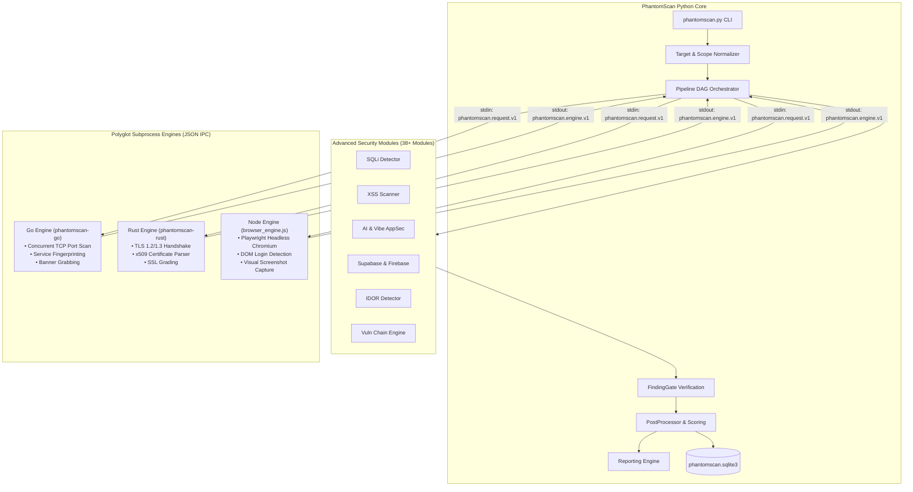
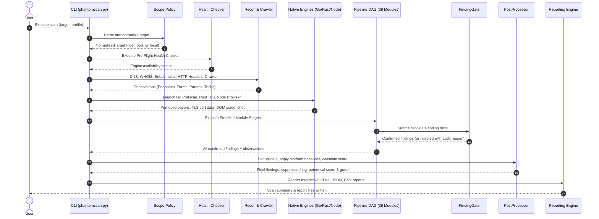
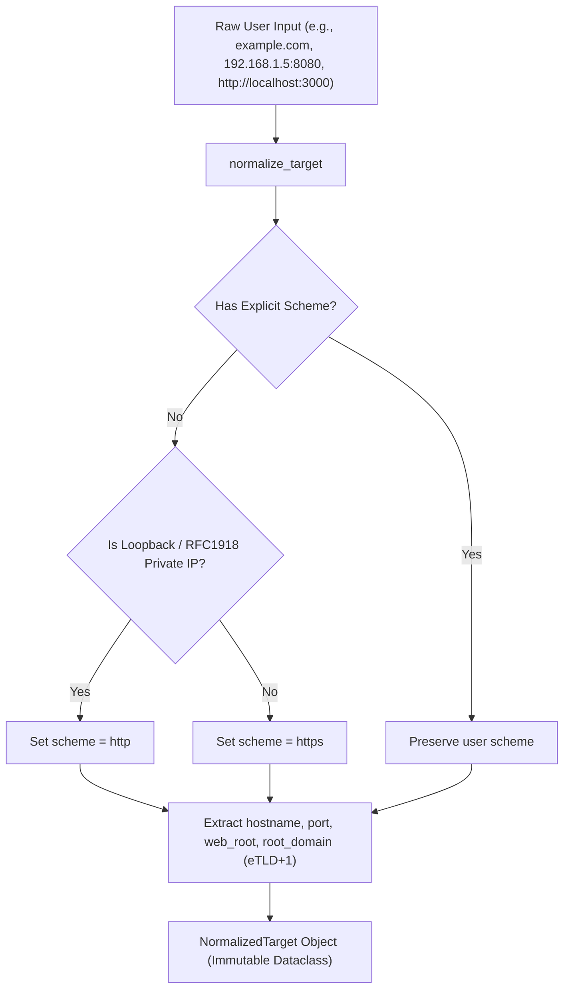
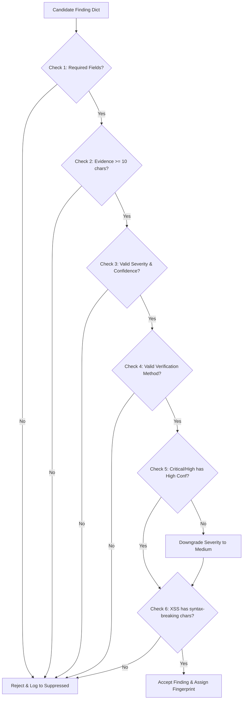
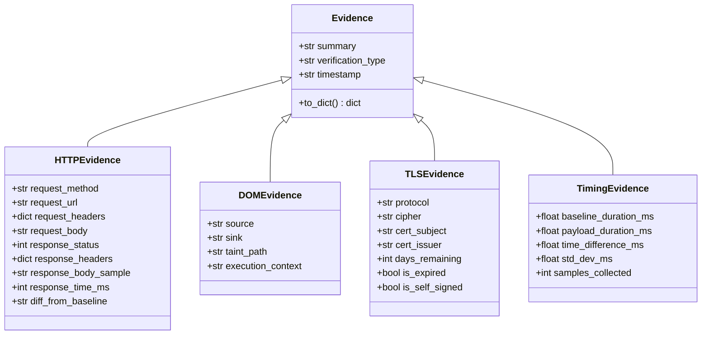
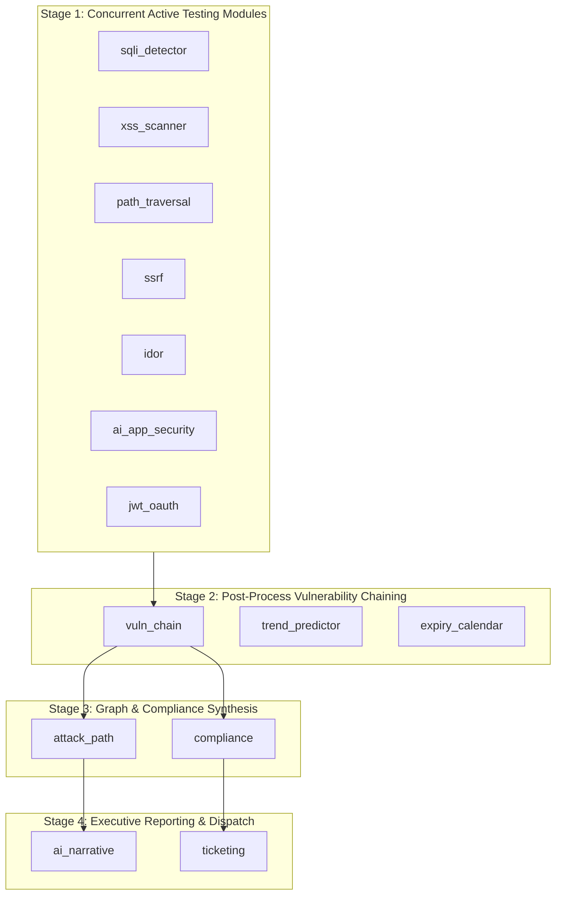

# PhantomScan — Complete Technical Feature & System Report

### **A Modular Cybersecurity Platform for Automated Vulnerability Assessment**

```text
Document Information:
- Project Name       : PhantomScan
- Architecture Version: 2.0.0 (Platform v2.1 Modular Release)
- Documentation Date : August 30, 2026
- Repository Reference: anshchavda02/Phantomscan
- Document Status    : Verified against Implementation (Zero-Hallucination Audit)
```

---

## Table of Contents

1. [Executive Summary](#1-executive-summary)
2. [Project Overview & Problem Statement](#2-project-overview--problem-statement)
3. [Master Feature Summary Matrix](#3-master-feature-summary-matrix)
4. [Complete System Architecture](#4-complete-system-architecture)
5. [Architecture Diagrams & Data Flow](#5-architecture-diagrams--data-flow)
6. [Repository & Directory Structure](#6-repository--directory-structure)
7. [Polyglot Language & Technology Stack](#7-polyglot-language--technology-stack)
8. [System Entry Points & Launchers](#8-system-entry-points--launchers)
9. [CLI Command-Line Interface Reference](#9-cli-command-line-interface-reference)
10. [Scan Profiles Reference & Comparison](#10-scan-profiles-reference--comparison)
11. [Target Types & Scope Management](#11-target-types--scope-management)
12. [Reconnaissance Subsystem](#12-reconnaissance-subsystem)
13. [Technology Fingerprinting & Asset Graph](#13-technology-fingerprinting--asset-graph)
14. [Complete Security Module Inventory (All 38+ Modules)](#14-complete-security-module-inventory-all-38-modules)
15. [Vulnerability Categories Breakdown](#15-vulnerability-categories-breakdown)
16. [Web Application Security Deep-Dive](#16-web-application-security-deep-dive)
17. [API Security & OpenAPI Analysis](#17-api-security--openapi-analysis)
18. [GraphQL Security Testing](#18-graphql-security-testing)
19. [Authentication & Session Security](#19-authentication--session-security)
20. [Authorization & IDOR Detection](#20-authorization--idor-detection)
21. [JWT & OAuth Security Testing](#21-jwt--oauth-security-testing)
22. [Business Logic & Race Condition Flaws](#22-business-logic--race-condition-flaws)
23. [Cloud & Backend-as-a-Service (BaaS) Security](#23-cloud--backend-as-a-service-baas-security)
24. [Secret Detection Architecture](#24-secret-detection-architecture)
25. [Supply Chain & AI Slopsquatting Detection](#25-supply-chain--ai-slopsquatting-detection)
26. [Native Go Network Port Scanner](#26-native-go-network-port-scanner)
27. [Native Rust TLS / SSL Inspection Engine](#27-native-rust-tls--ssl-inspection-engine)
28. [Node.js Headless Browser Engine](#28-nodejs-headless-browser-engine)
29. [DOM Security & Client-Side Analysis](#29-dom-security--client-side-analysis)
30. [JavaScript Route & Secret Analyzer](#30-javascript-route--secret-analyzer)
31. [Finding Lifecycle Engine](#31-finding-lifecycle-engine)
32. [FindingGate & Verification System](#32-findinggate--verification-system)
33. [False Positive Management & Platform Baselines](#33-false-positive-management--platform-baselines)
34. [Vulnerability Chaining & Attack Path Builder](#34-vulnerability-chaining--attack-path-builder)
35. [Risk Calculation, Deductions & Scoring Engine](#35-risk-calculation-deductions--scoring-engine)
36. [Structured Evidence System](#36-structured-evidence-system)
37. [Reporting Subsystem Architecture](#37-reporting-subsystem-architecture)
38. [Interactive HTML Report Deep-Dive](#38-interactive-html-report-deep-dive)
39. [Report Security & Sanitization](#39-report-security--sanitization)
40. [Multi-Format Outputs (HTML, JSON, CSV, SQLite)](#40-multi-format-outputs-html-json-csv-sqlite)
41. [Configuration System (`config.yaml`)](#41-configuration-system-configyaml)
42. [YAML Rule Engine (Nuclei/Xray Format)](#42-yaml-rule-engine-nucleixray-format)
43. [Extensibility & Developer Guide](#43-extensibility--developer-guide)
44. [Testing Suite & Quality Assurance](#44-testing-suite--quality-assurance)
45. [Build System & Native Compilation](#45-build-system--native-compilation)
46. [Cross-Platform Support (Windows, Linux, macOS)](#46-cross-platform-support-windows-linux-macos)
47. [Docker & Containerized Testing](#47-docker--containerized-testing)
48. [Security Model & Ethical Safeguards](#48-security-model--ethical-safeguards)
49. [Scan Lifecycle Walkthrough](#49-scan-lifecycle-walkthrough)
50. [End-to-End Local Lab Execution Walkthrough](#50-end-to-end-local-lab-execution-walkthrough)
51. [Module Interaction & Dependency DAG](#51-module-interaction--dependency-dag)
52. [Enterprise Performance & Resilience Architecture](#52-enterprise-performance--resilience-architecture)
53. [Error Handling & Degradation Matrix](#53-error-handling--degradation-matrix)
54. [Structured Logging & Diagnostics](#54-structured-logging--diagnostics)
55. [System Data Flow Architecture](#55-system-data-flow-architecture)
56. [Core Data Models & Schemas](#56-core-data-models--schemas)
57. [Dependency Overview](#57-dependency-overview)
58. [Project Differentiators](#58-project-differentiators)
59. [Current Limitations & Technical Debt](#59-current-limitations--technical-debt)
60. [Feature Maturity Matrix](#60-feature-maturity-matrix)
61. [Technical Quality Scorecard](#61-technical-quality-scorecard)
62. [Future Improvement Roadmap (P0 to P3)](#62-future-improvement-roadmap-p0-to-p3)
63. [Project-Based Learning (PBL) & Viva Presentation Summary](#63-project-based-learning-pbl--viva-presentation-summary)
64. [Viksit Bharat @ 2047 & UN Sustainable Development Goals](#64-viksit-bharat--2047--un-sustainable-development-goals)
65. [Conclusion](#65-conclusion)
66. [Appendices](#66-appendices)
    - [Appendix A: Complete Module Registry](#appendix-a-complete-module-registry)
    - [Appendix B: CLI Parameter Reference](#appendix-b-cli-parameter-reference)
    - [Appendix C: Default Configuration YAML](#appendix-c-default-configuration-yaml)
    - [Appendix D: Verified Technology Signatures](#appendix-d-verified-technology-signatures)
    - [Appendix E: JSON Output Schema Reference](#appendix-e-json-output-schema-reference)
    - [Appendix F: Key File Catalog](#appendix-f-key-file-catalog)
    - [Appendix G: Test Suite Organization](#appendix-g-test-suite-organization)
    - [Appendix H: Technical Glossary](#appendix-h-technical-glossary)

---

# 1. Executive Summary

**PhantomScan** is a modern, modular, polyglot cybersecurity platform engineered for automated web application, API, cloud infrastructure, and network vulnerability assessments. Built on a hybrid architecture combining an asynchronous Python 3 core with high-performance native engines written in **Go** (for concurrent network port discovery), **Rust** (for cryptographic TLS/SSL handshake inspection), and **Node.js/Playwright** (for headless browser interaction and DOM analysis), PhantomScan bridges the gap between shallow network port scanners and isolated web application scanners.

```
       ┌─────────────────────────────────────────────────────────────┐
       │                PhantomScan Polyglot Core                    │
       │   Python 3 (Async DAG) + Go (Network) + Rust (TLS/SSL)      │
       │             + Node.js (Playwright Headless Browser)         │
       └──────────────────────────────┬──────────────────────────────┘
                                      │
              ┌───────────────────────┼───────────────────────┐
              ▼                       ▼                       ▼
      ┌───────────────┐       ┌───────────────┐       ┌───────────────┐
      │  Asset Graph  │       │ FindingGate   │       │  Interactive  │
      │  & Discovery  │       │ Verification  │       │  HTML Report  │
      └───────────────┘       └───────────────┘       └───────────────┘
```

### Core Mission & Capabilities
1. **Automated Discovery & Reconnaissance**: Comprehensive DNS record collection, WHOIS/RDAP queries, certificate transparency (crt.sh) subdomain enumeration, DNS wordlist brute-forcing, asynchronous HTTP header inspection, and email security posture scoring (SPF, DMARC, DKIM, MX).
2. **Modern Web & Cloud/BaaS Vulnerability Coverage**: 38+ specialized detection modules targeting OWASP Top 10 vulnerabilities (SQLi, XSS, Path Traversal, SSRF, IDOR, HTTP Request Smuggling, Prototype Pollution), modern AI/vibe-coded app security issues (Supabase RLS bypass, Firebase test-mode open databases, client-side LLM API key leakage, AI proxy abuse, system prompt extraction, AI-hallucinated package slopsquatting), and GraphQL/tRPC/WebSocket APIs.
3. **Evidence-Based False Positive Suppression**: The built-in **FindingGate** and **PostProcessor** enforce multi-layer verification (statistical timing baselines, syntax-breaking character injection proof, baseline differentials, WAF block page rejection, and known-platform baseline calibrations).
4. **Vulnerability Chaining & Attack Path Synthesis**: Correlates independent low and medium severity findings into multi-step compound attack paths (e.g., SSRF + Cloud Metadata $\rightarrow$ IAM Credential Theft $\rightarrow$ Cloud Compromise) rendered as interactive D3.js graphs and visual Mermaid flowcharts.
5. **Standalone Interactive Reporting**: Generates zero-dependency, self-contained HTML reports featuring dark-mode glassmorphism styling, interactive client-side searching and filtering, live request/response HTTP payload inspectors with clipboard copying, D3.js attack surface graphs, compliance mapping (SOC 2, ISO 27001, HIPAA, PCI-DSS), and remediation tracking matrices, accompanied by machine-readable JSON and CSV exports.

---

# 2. Project Overview & Problem Statement

### 2.1 The Problem
Traditional vulnerability management tools suffer from significant architectural fragmentation:
- **Network port scanners** (e.g., Nmap) excel at TCP connection checks and service enumeration but provide virtually zero visibility into modern Single Page Application (SPA) client-side routing, GraphQL schemas, or cloud BaaS configurations.
- **Traditional DAST scanners** (e.g., OWASP ZAP, Burp Suite) are powerful but frequently generate overwhelming false positives on modern single-page JavaScript frontends and lack native understanding of next-generation backend stacks (Supabase, Firebase, tRPC, Prisma, Drizzle).
- **Static Secret Scanners** lack live validation, flooding reports with inactive placeholder tokens, example strings in documentation, and test fixtures.
- **AI-Generated / Vibe-Coded Applications**: Tools built with platforms like Lovable, Bolt.new, v0, Cursor, Replit, or Base44 introduce unique vulnerabilities—such as exposing database service role keys in frontend bundles, deploying Firebase in test-mode with universal read/write permissions, leaving tRPC procedures unauthenticated, or referencing non-existent AI-hallucinated packages (slopsquatting). Traditional scanners miss these vulnerabilities entirely.

### 2.2 The PhantomScan Solution
PhantomScan resolves these challenges through a unified, multi-engine platform:
- **Polyglot Execution Pipeline**: Combines the speed of compiled Go and Rust native binaries for network and cryptographic scans with the flexibility of Python's `asyncio` dependency DAG for security logic and Node.js for browser DOM rendering.
- **Strict Scope Enforcement**: Every target is parsed into a normalized domain, IP, CIDR, or URL structure. Scans strictly isolate network traffic to authorized hosts and prevent out-of-scope pivots.
- **Universal Finding Verification**: Through **FindingGate**, every candidate finding must satisfy strict confidence thresholds, provide non-empty substantive evidence, verify syntax escape, and clear false-positive suppressors before entering final reports.
- **Context-Aware Hybrid Scanning**: PhantomScan can combine black-box web crawling with local source path inspection (`--source-path`) to inspect ORM schemas (Prisma, Drizzle), `.env` files across Git commit history, and package manifests (`package.json`, `requirements.txt`).

### 2.3 Intended Users & Scope
PhantomScan is designed strictly for **authorized security assessments**:
- **Application Security (AppSec) Engineers**: Conducting automated vulnerability assessments of modern web applications, microservices, and APIs.
- **Penetration Testers & Red Teams**: Identifying initial access vectors, BaaS misconfigurations, and compound attack chains.
- **DevSecOps & Software Developers**: Integrating automated vulnerability regression testing into CI/CD build pipelines.
- **Cybersecurity Students & Researchers**: Studying polyglot scanner architectures, false-positive mitigation heuristics, and multi-tier vulnerability correlation.

---

# 3. Master Feature Summary Matrix

The following table summarizes all major features implemented in the PhantomScan codebase:

| Feature / Subsystem | Category | Status | Description | Implementation Source |
| :--- | :--- | :--- | :--- | :--- |
| **CLI Orchestrator & Banner** | Core CLI | 🟢 Implemented | Rich-powered terminal interface, argument parsing, engine health check | `phantomscan.py`, `models.py` |
| **Dependency DAG Pipeline** | Orchestration | 🟢 Implemented | Topological DAG sorting, concurrency bounds, tech pruning | `phantomscan/pipeline.py` |
| **Asset Graph Engine** | Asset Modeling | 🟢 Implemented | Graph representation of targets, services, technologies, endpoints | `phantomscan/asset_graph.py` |
| **Universal FindingGate** | Verification | 🟢 Implemented | 8-point finding verification, confidence gating, severity capping | `phantomscan/modules/finding_gate.py` |
| **PostProcessor & Scoring** | Scoring & FP | 🟢 Implemented | Platform suppression, deductions, security bonuses, letter grades | `phantomscan/postprocess.py` |
| **Go Port Scanner Engine** | Network Engine | 🟢 Implemented | Concurrent TCP connect scanning, banner grabbing, risky port classification | `engines/go/main.go` |
| **Rust TLS / SSL Engine** | Cryptography | 🟢 Implemented | Handshake inspection, x509 cert validity, SANs, SSL grading | `engines/rust/src/main.rs` |
| **Node / Playwright Engine** | Browser Engine | 🟢 Implemented | Headless DOM rendering, login detection, automated screenshot capture | `engines/node/browser_engine.js` |
| **Python Fallback Scanners** | Network Engine | 🟢 Implemented | Pure Python non-blocking TCP connect and TLS fallback scanners | `phantomscan/scanners.py` |
| **DNS & Subdomain Recon** | Reconnaissance | 🟢 Implemented | Async DNS records, crt.sh CT logs, DNS brute-forcing, WHOIS/RDAP | `phantomscan/recon.py` |
| **Email Security Analyzer** | Reconnaissance | 🟢 Implemented | SPF, DMARC, DKIM, MX DNS inspection, spoofability scoring | `phantomscan/email_security.py` |
| **Web Crawler & Form Parser** | Discovery | 🟢 Implemented | Async link extraction, form input discovery, ASP.NET WebForms support | `phantomscan/web_crawler.py` |
| **JavaScript Route Extractor** | Discovery | 🟢 Implemented | Regex bundle parsing for API routes, auth endpoints, embedded secrets | `phantomscan/js_analyzer.py` |
| **OpenAPI / Swagger Parser** | API Security | 🟢 Implemented | Discovers `/openapi.json`, `/swagger.json`, extracts API routes | `phantomscan/openapi_parser.py` |
| **Local App Auto-Profiler** | Calibration | 🟢 Implemented | Fingerprints Juice Shop, DVWA, WebGoat, bWAPP, Vulnweb | `phantomscan/local_app_profiles.py` |
| **SQL Injection Detector** | Active AppSec | 🟢 Implemented | 5-layer SQLi testing (error-based, 3-sample timing, boolean diff) | `phantomscan/modules/sqli_detector.py` |
| **Reflected XSS Scanner** | Active AppSec | 🟢 Implemented | Syntax-breaking probe injection, unencoded reflection, context analysis | `phantomscan/modules/xss_scanner.py` |
| **Path Traversal & LFI** | Active AppSec | 🟢 Implemented | Traversal probes (`/etc/passwd`, `win.ini`), response body verification | `phantomscan/modules/path_traversal.py` |
| **SSRF Detector** | Active AppSec | 🟢 Implemented | Query parameter testing for cloud metadata, loopback, internal IPs | `phantomscan/modules/ssrf_detector.py` |
| **IDOR Detector** | Active AppSec | 🟢 Implemented | Resource ID parameter mutation, differential body similarity checks | `phantomscan/modules/idor_detector.py` |
| **Business Logic Analyzer** | Active AppSec | 🟢 Implemented | Price tampering, negative quantities, cart state manipulation | `phantomscan/modules/business_logic.py` |
| **JWT & OAuth Tester** | Active AppSec | 🟢 Implemented | Alg: none attacks, weak HMAC secret cracking, OAuth redirect flaws | `phantomscan/modules/jwt_oauth.py` |
| **OOB Callback Detector** | Active AppSec | 🟢 Implemented | Out-of-band callback listener for Log4Shell, blind command injection | `phantomscan/modules/oob_detector.py` |
| **Race Condition Tester** | Active AppSec | 🟢 Implemented | Parallel synchronized burst testing for limit overruns | `phantomscan/modules/race_condition.py` |
| **HTTP Request Smuggling** | Active AppSec | 🟢 Implemented | Raw TCP socket testing for CL.TE and TE.CL desynchronization | `phantomscan/modules/http_smuggling.py` |
| **Prototype Pollution** | Active AppSec | 🟢 Implemented | Client and server-side `__proto__` pollution injection testing | `phantomscan/modules/prototype_pollution.py` |
| **GraphQL Security Tester** | API Security | 🟢 Implemented | Introspection query testing, batching attacks, field suggestions | `phantomscan/modules/graphql_tester.py` |
| **WebSocket Security Tester** | API Security | 🟢 Implemented | Origin validation, CSWSH, unauthenticated connection tests | `phantomscan/modules/websocket_tester.py` |
| **AI / Vibe-Coded AppSec** | Cloud / AI | 🟢 Implemented | 14 sub-scanners (Supabase, Firebase, Convex, LLM Keys, Prompt Leak) | `phantomscan/modules/ai_app_security.py` |
| **Secret Pattern Engine** | Secrets | 🟢 Implemented | 60+ JSON vendor patterns, Shannon entropy, comment filtering, masking | `data/secret_patterns.json`, `ai_app_security.py` |
| **Slopsquatting Detector** | Supply Chain | 🟢 Implemented | Identifies AI-hallucinated npm/PyPI dependencies | `phantomscan/modules/ai_app_security.py` |
| **Dependency Confusion** | Supply Chain | 🟢 Implemented | Unscoped internal package namespace squatter checks | `phantomscan/modules/dep_confusion.py` |
| **Subdomain Takeover** | Infrastructure | 🟢 Implemented | Dangling CNAME inspection across 20+ cloud provider fingerprints | `phantomscan/modules/subdomain_takeover.py` |
| **Vulnerability Chaining** | Correlation | 🟢 Implemented | 15+ compound exploit chain definitions (SSRF+Cloud, Supabase, etc.) | `phantomscan/modules/vuln_chain.py` |
| **Attack Path Builder** | Correlation | 🟢 Implemented | Generates Mermaid diagrams and D3.js attack surface graphs | `phantomscan/modules/attack_path.py` |
| **Compliance Reporter** | Governance | 🟢 Implemented | Maps findings to SOC 2, ISO 27001, HIPAA, PCI-DSS controls | `phantomscan/modules/compliance.py` |
| **Interactive HTML Report** | Reporting | 🟢 Implemented | Dark-mode glassmorphic report, live search, filters, D3 graph, evidence | `phantomscan/reporting.py`, `report.html.j2` |
| **JSON / CSV Exporters** | Reporting | 🟢 Implemented | Machine-readable finding schemas and spreadsheets | `phantomscan/reporting.py` |
| **SQLite Persistence** | Database | 🟢 Implemented | Persists scans, engine runs, and deduplicated findings | `phantomscan/db.py` |
| **YAML Rule Engine** | Rule Engine | 🟢 Implemented | Executes Nuclei/Xray style YAML vulnerability templates | `phantomscan/rules_engine.py` |
| **Enterprise Circuit Breakers** | Resilience | 🟢 Implemented | Failure tracking, threshold-based circuit opening, state transitions | `modules/circuit_breaker.py` |
| **Enterprise Scan Cache** | Performance | 🟢 Implemented | SQLite-backed caching for DNS, WHOIS, IP Intel with TTLs | `modules/scan_cache.py` |
| **Resource Governor** | Resilience | 🟢 Implemented | Memory ceiling enforcement and concurrent scan slot semaphores | `modules/resource_governor.py` |
| **Degradation Matrix** | Resilience | 🟢 Implemented | Pre-scan engine health diagnostics and graceful fallback table | `modules/degradation_matrix.py` |
| **Passive Proxy Mode** | Interception | 🟡 Partial | Mitmproxy integration to feed browser traffic to YAML rules | `phantomscan/proxy.py` |
| **PDF Report Exporter** | Reporting | 🔵 Experimental | Weasyprint-based PDF generator (requires system pango/cairo) | `phantomscan.py`, `requirements-optional.txt` |
| **Video Summary Generator** | Multimedia | 🔵 Experimental | Local TTS (`pyttsx3`) script and slide video generator | `phantomscan/modules/video_summary.py` |

---

# 4. Complete System Architecture

PhantomScan utilizes a multi-tiered polyglot architecture organized into six major functional layers:

```
┌─────────────────────────────────────────────────────────────────────────────┐
│                             1. PRESENTATION & CLI                           │
│   CLI Parser (phantomscan.py) ── PowerShell Launcher ── Batch Launcher      │
└──────────────────────────────────────┬──────────────────────────────────────┘
                                       │
┌──────────────────────────────────────▼──────────────────────────────────────┐
│                       2. INITIALIZATION & SCOPE POLICIES                    │
│   Target Normalizer (scope.py) ── Scope Policy ── Resource Governor (RAM)   │
│   Pre-Flight Engine Health Checker (health.py) ── Degradation Matrix        │
└──────────────────────────────────────┬──────────────────────────────────────┘
                                       │
┌──────────────────────────────────────▼──────────────────────────────────────┐
│                    3. RECONNAISSANCE & DISCOVERY LAYER                      │
│   DNS & Subdomain Recon (recon.py) ── Async HTTP Analyzer (http_client.py)  │
│   Email Security (SPF/DMARC/MX) ── OpenAPI Discovery (openapi_parser.py)    │
│   JS Route Extractor (js_analyzer.py) ── Web Crawler (web_crawler.py)       │
│   Local App Profiler (local_app_profiles.py) ── Asset Graph (asset_graph.py)│
└──────────────────────────────────────┬──────────────────────────────────────┘
                                       │
┌──────────────────────────────────────▼──────────────────────────────────────┐
│                     4. POLYGLOT SCANNING & DAG EXECUTION                    │
│   Go Engine (Port Scan) ── Rust Engine (TLS/SSL) ── Node.js (Browser/DOM)   │
│   Pipeline DAG Orchestrator (pipeline.py) ── 38+ Security Modules           │
│   YAML Rule Engine (rules_engine.py) ── Out-Of-Band Listener (oob.py)       │
└──────────────────────────────────────┬──────────────────────────────────────┘
                                       │
┌──────────────────────────────────────▼──────────────────────────────────────┐
│                 5. EVIDENCE, VERIFICATION & POST-PROCESSING                 │
│   Universal FindingGate (finding_gate.py) ── False Positive PostProcessor   │
│   Platform Baseline Calibrator ── Vulnerability Chaining (vuln_chain.py)    │
│   Attack Path Synthesizer (attack_path.py) ── Risk & Grade Scoring Engine   │
└──────────────────────────────────────┬──────────────────────────────────────┘
                                       │
┌──────────────────────────────────────▼──────────────────────────────────────┐
│                        6. REPORTING & PERSISTENCE                           │
│   Jinja2 Interactive HTML Report ── JSON & CSV Exporters ── SQLite Database │
│   Compliance Matrix (SOC2, ISO27001, HIPAA, PCI-DSS) ── Webhook Dispatcher  │
└─────────────────────────────────────────────────────────────────────────────┘
```

---

# 5. Architecture Diagrams & Data Flow

### 5.1 System Architecture & IPC
Communication between the Python orchestrator and native compiled engines operates strictly over standard I/O using versioned JSON schemas (`phantomscan.request.v1` and `phantomscan.engine.v1`).



### 5.2 Scan Lifecycle Flowchart



---

# 6. Repository & Directory Structure

The repository is structured into distinct, modular directories:

```text
Phantomscan-repo/
├── .github/                     # GitHub Actions CI/CD workflows
├── data/                        # Static datasets, signatures, and false positive rules
│   ├── false_positives/         # Platform-specific suppression rules (YAML)
│   ├── favicon_hashes.json      # Known web framework favicon MD5 hashes
│   ├── known_platforms.json     # Enterprise platform baselines (Cloudflare, AWS, etc.)
│   ├── rules/                   # Default system rules
│   └── secret_patterns.json     # 60+ vendor-specific API key regex signatures
├── docs/                        # Technical documentation and research papers
│   ├── ARCHITECTURE.md          # High-level architecture summary
│   ├── ENGINES.md               # Polyglot engine build instructions
│   ├── SCAN_ENGINE_AUDIT.md     # Engine audit and verification logs
│   ├── benchmark_results.md     # Measured benchmark findings across testbeds
│   └── research_paper/          # Formal academic research documentation
├── engines/                     # Native compiled inspection engines
│   ├── go/                      # Go network port scanner
│   │   ├── bin/                 # Compiled native Go binaries (phantomscan-go)
│   │   ├── go.mod               # Go module definition
│   │   ├── main.go              # Concurrent TCP connect scanner & banner grabber
│   │   └── main_test.go         # Go engine unit tests
│   ├── node/                    # Node.js / Playwright browser engine
│   │   ├── browser_engine.js    # Playwright Chromium controller & DOM analyzer
│   │   ├── browser_engine.test.js # Node engine unit tests
│   │   └── package.json         # NPM package dependencies (playwright)
│   └── rust/                    # Rust TLS / SSL inspection engine
│       ├── Cargo.toml           # Rust dependency manifest (rustls, x509-parser)
│       ├── src/main.rs          # TLS 1.2/1.3 handshake inspector & cert grader
│       └── target/release/      # Compiled release binary (phantomscan-rust)
├── logs/                        # Per-scan structured debug logs (*.log)
├── modules/                     # Enterprise resilience & performance modules
│   ├── adaptive_port_scan.py    # Adaptive port scanning heuristics
│   ├── catch_all_detector.py    # HTTP catch-all / SPA 200 soft-404 detector
│   ├── circuit_breaker.py       # Enterprise circuit breaker pattern
│   ├── degradation_matrix.py    # Engine degradation diagnostic table
│   ├── http_pool.py             # Global shared connection pool
│   ├── resource_governor.py     # Memory limit & concurrency governor
│   ├── response_validator.py    # Content-type & body validator
│   ├── scan_cache.py            # SQLite TTL caching (DNS, WHOIS, IP)
│   ├── scan_checkpoint.py       # Scan resumption & checkpoint state
│   ├── sensitive_path_scanner.py# Web-root sensitive file scanner with body verification
│   ├── structured_logging.py    # JSON / Text structured logging formatter
│   └── template_scanner.py      # Template loading and matching engine
├── phantomscan/                 # Core Python platform package
│   ├── __init__.py              # Package initialization
│   ├── advanced_scan.py         # Advanced scan orchestrator bridge
│   ├── asset_graph.py           # In-memory Asset Graph model
│   ├── db.py                    # SQLite database persistence layer
│   ├── email_security.py        # SPF, DMARC, DKIM, MX DNS inspection
│   ├── engines.py               # Asynchronous subprocess IPC engine runner
│   ├── health.py                # Pre-flight engine health checker
│   ├── http_client.py           # Robust async HTTP client with retry policy
│   ├── injection_target.py      # Normalized injection target parameter extractor
│   ├── js_analyzer.py           # JavaScript bundle route & secret extractor
│   ├── local_app_profiles.py    # Juice Shop, DVWA, WebGoat auto-profiler
│   ├── models.py                # Dataclasses (Finding, Observation, Evidence, Target)
│   ├── oob.py                   # Out-of-band callback server
│   ├── openapi_parser.py        # OpenAPI / Swagger discovery & parser
│   ├── pipeline.py              # Dependency DAG & topological scheduler
│   ├── postprocess.py           # Scoring, deduction caps, platform suppression
│   ├── progress.py              # Rich status & progress spinners
│   ├── proxy.py                 # Mitmproxy passive interception proxy
│   ├── recon.py                 # DNS, WHOIS, subdomains, headers, deep web
│   ├── report_models.py         # Reporting dataclasses & ViewModels
│   ├── reporting.py             # Jinja2 report generator & data parser
│   ├── rules_engine.py          # YAML vulnerability rule engine
│   ├── scanners.py              # Python fallback TCP and TLS scanners
│   ├── scope.py                 # Target URL parsing & scope policy enforcement
│   ├── web_crawler.py           # Async recursive crawler & form extractor
│   └── modules/                 # 38+ Specialized Security Modules
│       ├── ai_app_security.py   # AI & Vibe-Coded AppSec (14 sub-scanners)
│       ├── ai_narrative.py      # Executive narrative & remediation roadmap
│       ├── anti_automation.py   # Login rate limiting & brute-force testing
│       ├── attack_path.py       # Graph attack path generator
│       ├── auth_profiles.py     # Multi-role access control matrix tester
│       ├── auth_session.py      # Session fixation & cookie flag audit
│       ├── business_logic.py    # Business logic & price tampering tester
│       ├── cloud_metadata.py    # AWS, GCP, Azure metadata endpoint checker
│       ├── compliance.py        # SOC2, ISO27001, HIPAA, PCI-DSS mapper
│       ├── continuous_monitor.py# Scheduled diff monitor & webhook alerter
│       ├── db_error_signatures.py# SQL database error regex signatures
│       ├── dep_confusion.py     # Dependency confusion package checker
│       ├── diff_env_scanner.py  # Staging vs Production differential scanner
│       ├── expiry_calendar.py   # SSL/Domain expiration calendar builder
│       ├── finding_chat.py      # Interactive finding query assistant
│       ├── finding_gate.py      # Universal finding verification gate
│       ├── graphql_tester.py    # GraphQL introspection & batching tester
│       ├── header_analyzer.py   # Case-insensitive security header analyzer
│       ├── http_smuggling.py    # CL.TE / TE.CL HTTP request smuggling probe
│       ├── idor_detector.py     # IDOR parameter mutation detector
│       ├── jwt_oauth.py         # JWT none-alg, secret cracker, OAuth checker
│       ├── mobile_api.py        # Static APK/IPA decompiler & API extractor
│       ├── oob_detector.py      # Blind OOB injection & callback tester
│       ├── path_traversal.py    # Directory traversal & LFI scanner
│       ├── privacy_scanner.py   # PII leak & tracker audit scanner
│       ├── prototype_pollution.py# Prototype pollution injection detector
│       ├── race_condition.py    # Synchronized burst race condition tester
│       ├── remediation_verifier.py# Local verification re-test server
│       ├── scan_merger.py       # Team scan report merger & deduplicator
│       ├── second_order.py      # Second-order stored injection tester
│       ├── sqli_detector.py     # 5-layer SQL injection detector
│       ├── ssrf_detector.py     # Server-Side Request Forgery detector
│       ├── stateful_scanner.py  # Multi-step stateful workflow bypass tester
│       ├── subdomain_takeover.py# Dangling CNAME cloud takeover checker
│       ├── supply_chain.py      # Frontend JS dependency CVE analyzer
│       ├── ticketing.py         # Jira & GitHub Issues dispatcher
│       ├── trend_predictor.py   # Historical finding velocity forecaster
│       ├── video_summary.py     # Video walkthrough narration generator
│       ├── vuln_chain.py        # Multi-vulnerability compound attack chainer
│       ├── waf_detector.py      # WAF fingerprint & block page classifier
│       ├── websocket_tester.py  # CSWSH & WebSocket origin validator
│       └── xss_scanner.py       # Reflected XSS parameter & form tester
├── reports/                     # Generated HTML, JSON, CSV reports
├── rules/                       # YAML Vulnerability Rules
│   ├── config-exposure/         # Backup files, phpinfo, web.config rules
│   ├── cve/                     # CVE-specific exploit rules (e.g. Log4j)
│   ├── debug-panels/            # phpMyAdmin, server-status, ELMAH rules
│   ├── env-exposure/            # .env, .env.local, .env.production rules
│   └── git-exposure/            # .git/HEAD, .git/config rules
├── scripts/                     # Build, benchmark, and maintenance scripts
│   ├── benchmark.py             # Detection benchmark test harness
│   ├── build.sh                 # Multi-language build script
│   ├── check_deps.sh            # Dependency verifier
│   ├── install.sh               # Linux installer
│   ├── install_macos.sh         # macOS installer
│   └── verify_no_regressions.py # False positive regression test runner
├── templates/                   # Jinja2 report templates
│   ├── report.html.j2           # Master HTML report template
│   ├── pdf_report.html.j2       # Master PDF template
│   ├── partials/                # 32 UI components (D3 map, findings, charts, etc.)
│   └── sections/                # Report section wrappers
├── tests/                       # Automated test suites
│   ├── false_positive_regression/# False positive regression test suite
│   ├── fixtures/                # Mock HTTP responses and HTML samples
│   ├── integration/             # End-to-end integration tests
│   └── python/                  # 23 Unit test files covering all modules
├── Makefile                     # Make build automation targets
├── PhantomScan-Launcher.ps1     # Interactive PowerShell GUI/TUI launcher
├── config.yaml                  # System configuration file
├── install.bat                  # Windows installation batch file
├── launcher.bat                 # Windows quick launcher batch file
├── phantomscan.py               # CLI entrypoint orchestrator
├── phantomscan.sqlite3          # SQLite scan database
├── requirements.txt             # Core Python dependencies
└── requirements-optional.txt    # Optional dependencies (weasyprint, mitmproxy)
```

---

# 7. Polyglot Language & Technology Stack

| Technology | Version / Requirement | Purpose in PhantomScan | Major Components |
| :--- | :--- | :--- | :--- |
| **Python** | $\ge$ 3.10 | Core orchestrator, DAG scheduler, 38+ security modules, reporting, SQLite database | `phantomscan.py`, `pipeline.py`, `modules/*.py`, `reporting.py` |
| **Go** | $\ge$ 1.21 | High-speed concurrent network port scanning & banner grabbing | `engines/go/main.go`, `engines/go/bin/phantomscan-go` |
| **Rust** | $\ge$ 1.75 | High-performance TLS 1.2/1.3 handshake inspection & X.509 cert analysis | `engines/rust/src/main.rs`, `engines/rust/target/release/phantomscan-rust` |
| **Node.js** | $\ge$ 18.0 | Headless Chromium browser automation via Playwright | `engines/node/browser_engine.js` |
| **Playwright** | $\ge$ 1.40 | Headless browser DOM rendering, login detection, screenshot capture | `engines/node/browser_engine.js` |
| **Jinja2** | $\ge$ 3.1.0 | Standalone interactive HTML report template rendering | `templates/report.html.j2`, `templates/partials/*.j2` |
| **D3.js** | v7 (Embedded) | Force-directed interactive attack surface map rendering in report | `templates/partials/attack_map.html.j2` |
| **SQLite3** | Native | Scan session metadata, finding persistence, scan caching, and checkpoints | `phantomscan/db.py`, `modules/scan_cache.py` |
| **Aiohttp** | $\ge$ 3.9.0 | Asynchronous non-blocking HTTP/HTTPS networking client | `phantomscan/http_client.py`, `recon.py` |
| **Dnspython** | $\ge$ 2.6.0 | Asynchronous DNS record queries and resolver utilities | `phantomscan/recon.py` |
| **Rich** | $\ge$ 13.7.0 | Colored terminal formatting, live progress spinners, log tables | `phantomscan.py`, `phantomscan/progress.py` |
| **PyYAML** | $\ge$ 6.0.1 | YAML configuration loading and Nuclei/Xray rule parsing | `phantomscan/rules_engine.py`, `config.yaml` |

---

# 8. System Entry Points & Launchers

### 8.1 Python CLI Orchestrator (`phantomscan.py`)
- **Invocation**: `python phantomscan.py --target <TARGET> [OPTIONS]`
- **Role**: The primary command-line interface. Parses user arguments, configures logging, initializes the SQLite database, runs pre-flight health checks, coordinates reconnaissance, invokes native engines, executes the DAG module pipeline, and generates reports.

### 8.2 Interactive PowerShell Launcher (`PhantomScan-Launcher.ps1`)
- **Invocation**: `powershell -ExecutionPolicy Bypass -File .\PhantomScan-Launcher.ps1`
- **Role**: A Windows terminal TUI with ASCII art, color-coded menus, target prompts, profile selection, automatic `.venv` detection, and instant post-scan HTML report launching in the default browser.

### 8.3 Windows Batch Launchers (`launcher.bat`, `PhantomScan Launcher.bat`)
- **Invocation**: Double-click or run `launcher.bat` from `cmd.exe`
- **Role**: Simple wrapper that executes `PhantomScan-Launcher.ps1` with bypassed execution policy.

### 8.4 Native Compiled Binaries
- **Go Port Scanner**: `engines/go/bin/phantomscan-go` (or `.exe` on Windows)
  - Invoked automatically by `phantomscan/engines.py` as an asynchronous subprocess. Reads `phantomscan.request.v1` JSON on STDIN, writes `phantomscan.engine.v1` JSON to STDOUT.
- **Rust TLS Inspector**: `engines/rust/target/release/phantomscan-rust` (or `.exe` on Windows)
  - Invoked automatically by `phantomscan/engines.py` as an asynchronous subprocess. Reads JSON on STDIN, writes JSON to STDOUT.
- **Node.js Browser Engine**: `node engines/node/browser_engine.js`
  - Invoked automatically by `phantomscan/engines.py` as an asynchronous subprocess. Reads JSON on STDIN, writes JSON to STDOUT.

### 8.5 Test Harness & Benchmark Runner (`scripts/benchmark.py`)
- **Invocation**: `python scripts/benchmark.py --target http://localhost:3000 --profile deepscan`
- **Role**: Measures scanner detection accuracy, false-positive rates, execution duration, and score against clean targets or vulnerable testbeds (OWASP Juice Shop).

---

# 9. CLI Command-Line Interface Reference

The CLI options defined in `phantomscan.py::build_parser` are organized as follows:

### 9.1 Target Selection
| Option | Argument | Type | Default | Description |
| :--- | :--- | :--- | :--- | :--- |
| `--target` | `<TARGET>` | string | `None` | Single target domain, IP, CIDR, or URL (e.g. `example.com`, `http://localhost:3000`) |
| `--batch` | `<FILE>` | path | `None` | File containing a list of targets (one per line) |

### 9.2 Scan Profiles & Module Selection
| Option | Argument | Type | Default | Description |
| :--- | :--- | :--- | :--- | :--- |
| `--profile` | `<PROFILE>` | choice | `quick` | Selects scan profile: `quick`, `full`, `passive`, `owasp`, `bug-bounty`, `api`, `network`, `advanced`, `deep`, `deepscan` |
| `--ports` | `<PORTS>` | string | `top100` | Ports to scan (`top100`, `top1000`, or comma list `80,443,8080`) |
| `--advanced` | None | flag | `False` | Run all 38 advanced security modules |
| `--modules` | `<LIST>` | string | `None` | Comma-separated list of specific modules to run (e.g., `ai_app_security,idor,sqli_detector`) |
| `--source-path`| `<DIR>` | path | `None` | Local source path for hybrid white-box + black-box scanning (Prisma, Drizzle, `.env` git history) |
| `--check-slopsquatting` | None | flag | `False` | Check project dependencies for AI-hallucinated packages (requires `--source-path`) |
| `--local-app` | `<APP>` | choice | `None` | Optimize scan for known vulnerable apps: `juiceshop`, `dvwa`, `webgoat`, `bwapp`, `vulnweb`, `auto` |
| `--crawl-depth`| `<INT>` | integer| `None` | Web crawler recursion depth limit (overrides profile default) |
| `--depth` | `<INT>` | integer| `1` | General crawl depth limit |
| `--proxy` | `<H:P>` | string | `None` | Start passive proxy mode on `HOST:PORT` (e.g., `127.0.0.1:8080`) |

### 9.3 Authenticated & Multi-Role Scanning
| Option | Argument | Type | Default | Description |
| :--- | :--- | :--- | :--- | :--- |
| `--auth-cookie` | `<COOKIE>` | string | `None` | Authentication cookie string for stateful session scanning |
| `--auth-token` | `<TOKEN>` | string | `None` | Bearer token for authenticated API scanning |
| `--auth-profile`| `<PATH>` | path | `None` | Path to encrypted AuthProfile file (can be repeated) |
| `--multi-role-scan` | None | flag | `False` | Perform multi-role access control testing across auth profiles |

### 9.4 Differential & Mobile Security
| Option | Argument | Type | Default | Description |
| :--- | :--- | :--- | :--- | :--- |
| `--diff-env` | None | flag | `False` | Run differential environment scanner comparing Staging vs Production |
| `--staging` | `<URL>` | string | `None` | Staging target URL/domain |
| `--production` | `<URL>` | string | `None` | Production target URL/domain |
| `--mobile-apk` | `<PATH>` | path | `None` | Path to Android APK binary to decompile and extract backend APIs |
| `--mobile-ipa` | `<PATH>` | path | `None` | Path to iOS IPA binary to extract backend APIs |
| `--extract-apis`| None | flag | `False` | Extract and test backend APIs from mobile app binaries |
| `--check-deps` | `<PATH>` | path | `None` | Path to project directory to check for Dependency Confusion risks |

### 9.5 Integrations, Analytics & Operations
| Option | Argument | Type | Default | Description |
| :--- | :--- | :--- | :--- | :--- |
| `--ticket-provider` | `<PROV>` | choice | `None` | Ticketing integration provider: `jira`, `slack`, `teams` |
| `--jira-url` | `<URL>` | string | `None` | Jira instance URL (e.g. `https://company.atlassian.net`) |
| `--jira-user` | `<USER>` | string | `None` | Jira username / email |
| `--jira-token` | `<TOKEN>` | string | `None` | Jira API token |
| `--jira-project`| `<KEY>` | string | `SEC` | Jira project key |
| `--slack-webhook`| `<URL>` | string | `None` | Slack Webhook URL for real-time alerting |
| `--teams-webhook`| `<URL>` | string | `None` | Microsoft Teams Webhook URL for alerting |
| `--auto-ticket` | `<SEVS>` | string | `None` | Comma-separated severities to auto-ticket (e.g. `critical,high`) |
| `--expiry-calendar` | None | flag | `False` | Generate standalone HTML expiry calendar for targets |
| `--video-summary` | None | flag | `False` | Generate executive video summary walkthrough via local TTS |
| `--baseline` | `<PATH>` | path | `None` | Path to previous JSON report for continuous monitoring diff |
| `--webhook` | `<URL>` | string | `None` | URL to send alerts for new findings (Continuous Monitor) |
| `--merge` | `<FILES>` | list | `None` | JSON scan report files to merge and deduplicate |
| `--serve-verify`| None | flag | `False` | Start local lightweight remediation verification server |
| `--verify-port` | `<PORT>` | integer| `8420` | Port for remediation verification server |

### 9.6 Performance, Tuning & Output
| Option | Argument | Type | Default | Description |
| :--- | :--- | :--- | :--- | :--- |
| `--debug` | None | flag | `False` | Enable verbose debug logging and pre-scan engine health checks |
| `--silent` | None | flag | `False` | Suppress rich terminal output (useful for piping) |
| `--confidence` | `<CONF>` | choice | `high` | Minimum confidence level to report (`high`, `medium`, `low`) |
| `--show-medium` | None | flag | `False` | Include medium-confidence findings in report |
| `--show-all` | None | flag | `False` | Include all findings regardless of confidence |
| `--json` | None | flag | `False` | Print JSON findings to stdout at the end of the scan |
| `--json-out` | `<PATH>` | path | `None` | Custom path to save the JSON report |
| `--pdf` | None | flag | `False` | Generate PDF report (experimental, requires WeasyPrint) |
| `--pdf-out` | `<PATH>` | path | `None` | Custom path to save the PDF report |
| `--log-file` | `<PATH>` | path | `None` | Custom path for debug log file |
| `--time-budget` | `<SEC>` | integer| `None` | Maximum total scan time in seconds. Degrades gracefully. |
| `--log-format` | `<FMT>` | choice | `text` | Log format: `text` or `json` (machine-parseable) |
| `--max-memory-mb`| `<MB>` | integer| `2048` | Maximum memory ceiling in MB |
| `--max-concurrent-scans`| `<N>`| integer| `5` | Maximum concurrent batch scans |

---

# 10. Scan Profiles Reference & Comparison

PhantomScan scan profiles adapt discovery depth, port count, crawler behavior, and module execution sets to the assessment context:

| Scan Profile | Port Range | Crawler Depth | Native Engines Active | Advanced Modules Active | Primary Target Context | Typical Duration |
| :--- | :--- | :---: | :---: | :---: | :--- | :--- |
| **`quick`** | Top 100 | None | Go, Rust, Node | ❌ Disabled | Fast health checks, staging smoke tests, basic header/SSL checks | 5–15 sec |
| **`full`** | Top 1000 | Depth 1 (50 pgs) | Go, Rust, Node | ❌ Disabled (YAML Engine on) | Standard DAST assessment, deep web paths, CORS, cookies | 30–60 sec |
| **`passive`** | None (0) | None | ❌ Disabled | ❌ Disabled | Safe reconnaissance, DNS, WHOIS, email posture, no active fuzzing | 3–8 sec |
| **`api`** | Top 100 | None | Go, Rust | OpenAPI, GraphQL, JWT | Pure API/backend assessments without HTML crawling | 10–25 sec |
| **`network`** | Top 1000 | None | Go (Intensive) | ❌ Disabled | Infrastructure and exposed service focus; skips web rules | 15–30 sec |
| **`owasp`** | Top 100 | Depth 2 (60 pgs) | Go, Rust, Node | OWASP Top 10 Modules | Targeted web security audit against OWASP Top 10 | 45–90 sec |
| **`bug-bounty`** | Top 1000 | Depth 1 (50 pgs) | Go, Rust, Node | Takeover, Cloud, Secrets | External attack surface enumeration and critical takeover vectors | 60–120 sec |
| **`advanced`** | Top 100 | Depth 2 (60 pgs) | Go, Rust, Node | 🟢 All 38+ Modules (Pruned) | Modern web applications, BaaS, logic, IDOR, AI app security | 60–120 sec |
| **`deep` / `deepscan`** | Top 1000 | Depth 3 (150 pgs)| Go, Rust, Node | 🟢 All 38+ Modules (Force All)| Comprehensive audit: all native engines, deep crawl, unpruned DAG | 120–300 sec |
| **`monitor`** | None | None | ❌ Disabled | Continuous Monitor only | Scheduled diff scans against baseline JSON | 5–10 sec |

---

# 11. Target Types & Scope Management

Scope validation in `phantomscan/scope.py::normalize_target` normalizes inputs and enforces strict security boundaries:



### Supported Target Types
1. **Domain Names** (`example.com`, `sub.example.com`):
   - Automatically extracts root domain (`eTLD+1`) using `tldextract`.
   - Defaults to `https://` if no scheme specified. Port defaults to 443.
2. **IP Addresses** (`192.168.1.50`, `10.0.0.1`):
   - Validated via `ipaddress.ip_address`.
   - Identifies private vs public IP status.
3. **Localhost / Development Servers** (`localhost:3000`, `127.0.0.1:8080`):
   - Marked as `is_local = True`.
   - **Scope Rule PR-L01**: Automatically skips external-only modules (e.g. Subdomain Takeover, WHOIS queries, public DNS resolvers).
4. **Full URLs** (`http://testphp.vulnweb.com/listproducts.php?cat=1`):
   - Preserves path and query parameters for targeted injection. Base URL extracted for root scanning.
5. **CIDR Network Blocks** (`192.168.1.0/24`):
   - Target type marked as `cidr`. Bounded by `cidr_live_host_limit` in `config.yaml`.

---

# 12. Reconnaissance Subsystem

Implemented in `phantomscan/recon.py`, the reconnaissance subsystem performs passive and active discovery:

### 12.1 DNS Resolution & Record Collection
- **Async DNS Resolver**: Uses `dnspython` configured with public DNS resolvers (`8.8.8.8`, `1.1.1.1`).
- **Record Types Harvested**: `A`, `AAAA`, `MX`, `NS`, `TXT` (SPF, verification tokens), and `CNAME` records.
- **Reverse PTR**: Performs asynchronous PTR reverse DNS resolution for IP targets.

### 12.2 WHOIS & RDAP Intelligence
- Queries RDAP endpoints and WHOIS registrars to extract:
  - Domain registrar name and status codes.
  - Creation, last updated, and expiration dates.
  - Calculated `days_remaining` until domain expiration.

### 12.3 Subdomain Enumeration
- **Certificate Transparency (CT Logs)**: Queries `crt.sh` API asynchronously to harvest historical and active certificates issued for the target domain.
- **Brute-Force Wordlist**: Asynchronously resolves top 80+ high-value subdomains (`admin`, `api`, `dev`, `staging`, `vpn`, `portal`, `auth`, `corp`, `jenkins`, `grafana`, `kibana`, `db`, `s3`).

### 12.4 Email Security Assessment (`phantomscan/email_security.py`)
- Analyzes domain DNS records for email spoofing defenses:
  - **SPF Evaluation**: Checks for `v=spf1`, validates `all` mechanism (`-all` hard fail vs `~all` soft fail vs `+all` dangerous allow).
  - **DMARC Evaluation**: Checks for `v=DMARC1`, validates policy (`p=reject`, `p=quarantine`, `p=none`), checks percentage (`pct=100`) and reporting addresses (`rua`).
  - **DKIM Check**: Probes standard selectors (`google`, `default`, `k1`, `mail`).
  - **Spoofability Score**: Calculates numerical rating (0–100) based on SPF/DMARC posture.

---

# 13. Technology Fingerprinting & Asset Graph

### 13.1 Fingerprinting Methodology
Technology detection operates passively by analyzing HTTP headers, cookie flags, HTML markup, script paths, and favicon hashes:

```
┌─────────────────────────────────────────────────────────────────────────────────────────────┐
│                                    HTTP Response Signals                                    │
├──────────────────────┬────────────────────────┬────────────────────────┬────────────────────┤
│ HTTP Headers         │ Set-Cookie             │ HTML / DOM             │ Favicon Hash       │
│ Server, X-Powered-By │ PHPSESSID, JSESSIONID  │ meta name="generator"  │ MurmurHash3        │
│ Via, X-AspNet-Ver    │ connect.sid, cf_clear  │ <script src="...react" │ MD5 Favicon Hash   │
└──────────┬───────────┴───────────┬────────────┴───────────┬────────────┴─────────┬──────────┘
           └───────────────────────┴──────────┬─────────────┴──────────────────────┘
                                              ▼
                           ┌───────────────────────────────────────┐
                           │     detect_technologies() Matcher     │
                           └───────────────────┬───────────────────┘
                                               ▼
                           ┌───────────────────────────────────────┐
                           │        Asset Graph Integration        │
                           │    (Enables Tech-Aware DAG Pruning)   │
                           └───────────────────────────────────────┘
```

### 13.2 Detected Technologies Catalog
- **Web Servers**: Nginx, Apache, Microsoft-IIS, Caddy, LiteSpeed, Cloudflare Server.
- **Frameworks & Runtimes**: Next.js, React, Vue.js, Angular, Django, Flask, Express, Laravel, Spring Boot, ASP.NET.
- **BaaS & Cloud Providers**: Supabase, Firebase, AWS, Cloudflare CDN/WAF, Fastly, Akamai, Vercel, Netlify.
- **Databases & APIs**: GraphQL, tRPC, PostgreSQL, MySQL, Redis, MongoDB.

### 13.3 Asset Graph Model (`phantomscan/asset_graph.py`)
Maintains an in-memory graph connecting assets (Domains $\rightarrow$ Hosts $\rightarrow$ Ports $\rightarrow$ Endpoints $\rightarrow$ Parameters $\rightarrow$ Technologies). The DAG scheduler uses `AssetGraph.has_technology(tech)` to prune modules whose prerequisite technologies are absent on the target.

---

# 14. Complete Security Module Inventory (All 38+ Modules)

The following inventory documents every security module registered in `phantomscan/modules/__init__.py::MODULE_REGISTRY`:

### Master Module Summary Table

| # | Module Key | Module Class Name | Phase | Default Timeout | Primary Vulnerability / Function |
| :-: | :--- | :--- | :---: | :---: | :--- |
| 1 | `sqli_detector` | `SQLiDetector` | Active | 60.0s | SQL Injection (Error, Time-based Blind, Boolean Diff) |
| 2 | `xss_scanner` | `XSSScanner` | Active | 50.0s | Reflected XSS across URL query parameters and forms |
| 3 | `path_traversal` | `PathTraversalScanner` | Active | 40.0s | Directory Traversal & Local File Inclusion (LFI) |
| 4 | `ssrf` | `SSRFDetector` | Active | 40.0s | Server-Side Request Forgery on URL parameters |
| 5 | `business_logic` | `BusinessLogicAnalyzer` | Active | 45.0s | Price tampering, negative quantities, cart manipulation |
| 6 | `idor` | `IDORDetector` | Active | 40.0s | Insecure Direct Object Reference on numeric/UUID IDs |
| 7 | `jwt_oauth` | `JWTOAuthTester` | Active | 30.0s | JWT alg: none, weak secret cracking, OAuth flaws |
| 8 | `oob_detector` | `OOBDetector` | Active | 35.0s | Out-Of-Band callback verification (Log4j, Blind RCE) |
| 9 | `race_condition` | `RaceConditionDetector` | Active | 30.0s | Concurrency limit overrun race conditions |
| 10 | `http_smuggling` | `HTTPSmugglingDetector` | Active | 30.0s | CL.TE & TE.CL HTTP request smuggling on raw TCP |
| 11 | `prototype_pollution` | `PrototypePollutionDetector` | Active | 30.0s | Client and Server-side JS prototype pollution |
| 12 | `graphql` | `GraphQLTester` | Active | 35.0s | Introspection exposure, batching, field suggestions |
| 13 | `websocket` | `WebSocketTester` | Active | 30.0s | Cross-Site WebSocket Hijacking & auth bypass |
| 14 | `supply_chain` | `SupplyChainAnalyzer` | Active | 35.0s | Outdated frontend JavaScript library CVE lookup |
| 15 | `cloud_metadata` | `CloudMetadataDetector` | Active | 25.0s | AWS, GCP, Azure instance metadata exposure |
| 16 | `second_order` | `SecondOrderDetector` | Active | 40.0s | Stored XSS and second-order SQLi polling |
| 17 | `auth_session` | `AuthSessionManager` | Active | 30.0s | Session fixation, cookie flags, logout invalidation |
| 18 | `auth_profiles` | `AuthenticatedScanner` | Active | 40.0s | Multi-role privilege matrix verification |
| 19 | `diff_env` | `DifferentialScanner` | Active | 30.0s | Staging vs Production configuration drift & leaks |
| 20 | `mobile_api` | `MobileAPIExtractor` | Active | 30.0s | Static APK/IPA decompiler & backend API extractor |
| 21 | `dep_confusion` | `DependencyConfusionChecker` | Active | 30.0s | Internal unscoped package squatter checker |
| 22 | `subdomain_takeover` | `SubdomainTakeoverDetector` | Active | 35.0s | Dangling CNAME cloud takeover detection |
| 23 | `anti_automation` | `AntiAutomationTester` | Active | 30.0s | Rate limit, brute-force & CAPTCHA bypass tests |
| 24 | `privacy_scanner` | `PrivacyScanner` | Active | 30.0s | PII leakage, trackers, cookie consent audit |
| 25 | `ai_app_security` | `AIAppSecurityScanner` | Active | 45.0s | 14 sub-scanners for AI/BaaS/Vibe web applications |
| 26 | `stateful_scanner` | `StatefulScanner` | Active | 40.0s | Multi-step checkout/wizard state bypass testing |
| 27 | `vuln_chain` | `VulnChainEngine` | Post-Process | 20.0s | Multi-vulnerability compound attack path chainer |
| 28 | `attack_path` | `AttackPathBuilder` | Post-Process | 20.0s | Generates visual Mermaid & D3.js attack paths |
| 29 | `compliance` | `ComplianceReporter` | Post-Process | 20.0s | Maps findings to SOC2, ISO27001, HIPAA, PCI-DSS |
| 30 | `ai_narrative` | `AINarrativeReporter` | Post-Process | 25.0s | Executive summary & remediation roadmap synthesis |
| 31 | `trend_predictor` | `TrendPredictor` | Post-Process | 15.0s | Historical finding velocity & posture trend analysis |
| 32 | `expiry_calendar` | `ExpiryCalendarBuilder` | Post-Process | 15.0s | SSL & domain expiration calendar generator |
| 33 | `scan_merger` | `TeamScanMerger` | Post-Process | 15.0s | Aggregates and deduplicates team JSON scan files |
| 34 | `continuous_monitor` | `ContinuousMonitor` | Post-Process | 20.0s | Scheduled diff monitoring against baseline reports |
| 35 | `ticketing` | `TicketingIntegration` | Post-Process | 15.0s | Auto-dispatches findings to Jira, Slack, Teams |
| 36 | `video_summary` | `VideoSummaryGenerator` | Post-Process | 30.0s | Video walkthrough script and narration generator |
| 37 | `remediation_verifier` | `RemediationVerifier` | Post-Process | 20.0s | Local verification server re-testing patches |
| 38 | `finding_chat` | `FindingChatAssistant` | Post-Process | 20.0s | Interactive CLI conversational query assistant |

---

### 14.1 Detailed Module Specifications

#### 1. `sqli_detector` (`SQLiDetector`)
- **Source**: `phantomscan/modules/sqli_detector.py`
- **Purpose**: Detects SQL Injection across query parameters and discovered form inputs.
- **Methodology**: Executes a 5-layer verification pipeline:
  1. *Baseline Capture*: Captures standard response status, length, and error-free body.
  2. *Error-Based Probing*: Injects SQL syntax markers (`'`, `1'`, `' OR '1'='1`) and evaluates responses against exact vendor database regex signatures (MySQL, PostgreSQL, MSSQL, Oracle, SQLite, DB2).
  3. *WAF Exclusion*: Automatically discards responses classified as WAF block pages by `waf_detector.py`.
  4. *Time-Based Blind Verification*: Injects sleep payloads (`' AND SLEEP(5)-- -`, `WAITFOR DELAY '0:0:5'`). Gathers 3 baseline timing samples; requires payload duration to exceed $\mu + 3\sigma$ with 2 independent reproductions.
  5. *Boolean Differential*: Compares TRUE (`1 OR 1=1`) vs FALSE (`1 AND 1=2`) response bodies.
- **Severity / Confidence**: Critical / High.
- **Verification Method**: `active_confirmation` / `baseline_differential`.

#### 2. `xss_scanner` (`XSSScanner`)
- **Source**: `phantomscan/modules/xss_scanner.py`
- **Purpose**: Detects Reflected Cross-Site Scripting (XSS).
- **Methodology**: Injects safe marker payloads (`<phantomscan-xss-test>`, `"><phantomscan_xss_break>`). Verifies that characters (`<`, `>`, `"`, `'`) appear unencoded in the response body. Analyzes HTML context: if reflection occurs within an HTML comment or script string without context escape, severity is capped at `info`.
- **Severity / Confidence**: High / High.
- **Verification Method**: `active_confirmation`.

#### 3. `path_traversal` (`PathTraversalScanner`)
- **Source**: `phantomscan/modules/path_traversal.py`
- **Purpose**: Detects Local File Inclusion (LFI) and Directory Traversal.
- **Methodology**: Injects standard traversal sequences (`../../../../etc/passwd`, `..\..\..\..\windows\win.ini`). Proves exploitation by verifying explicit file contents (`root:x:0:0` or `[fonts]`). Rejects soft-404s and generic error pages.
- **Severity / Confidence**: Critical / High.

#### 4. `ssrf` (`SSRFDetector`)
- **Source**: `phantomscan/modules/ssrf_detector.py`
- **Purpose**: Detects Server-Side Request Forgery on URL parameters.
- **Methodology**: Identifies URL-bearing query parameters (`url=`, `dest=`, `redirect=`, `src=`, `feed=`). Injects probes targeting `169.254.169.254` (cloud metadata), `127.0.0.1` (loopback services), and external OOB callback URLs.
- **Severity / Confidence**: Critical / High.

#### 5. `business_logic` (`BusinessLogicAnalyzer`)
- **Source**: `phantomscan/modules/business_logic.py`
- **Purpose**: Detects business logic flaws in e-commerce and transaction workflows.
- **Methodology**: Tests API endpoints handling financial values:
  - Injects negative amounts (`price=-10`, `quantity=-5`).
  - Tests fractional/zero amounts (`amount=0.001`, `price=0`).
  - Tests integer overflow quantities (`quantity=99999999999`).
  - Verifies if the backend accepts modified values without server-side validation.
- **Severity / Confidence**: High / High.

#### 6. `idor` (`IDORDetector`)
- **Source**: `phantomscan/modules/idor_detector.py`
- **Purpose**: Detects Insecure Direct Object References.
- **Methodology**: Identifies numeric and UUID parameters in paths (`/api/users/105`) and query strings (`?account_id=1001`). Mutates the ID (e.g., $105 \rightarrow 104, 106$). Compares response body similarity against the baseline to verify unauthorized access to adjacent user records.
- **Severity / Confidence**: High / High.

#### 7. `jwt_oauth` (`JWTOAuthTester`)
- **Source**: `phantomscan/modules/jwt_oauth.py`
- **Purpose**: Tests JSON Web Tokens and OAuth 2.0 implementations.
- **Methodology**:
  - *None Algorithm Attack*: Modifies JWT header to `{"alg": "none"}` and strips the signature.
  - *Weak Secret Cracking*: Attempts HMAC-SHA256 verification against a built-in dictionary of 100+ common secrets (`secret`, `jwt_secret`, `password`).
  - *Expiration Check*: Verifies whether the server accepts expired tokens (`exp` in the past).
  - *OAuth Redirect Flaws*: Tests authorization flows for open redirect parameter acceptance.
- **Severity / Confidence**: Critical / High.

#### 8. `oob_detector` (`OOBDetector`)
- **Source**: `phantomscan/modules/oob_detector.py`
- **Purpose**: Detects Out-Of-Band blind injection vulnerabilities.
- **Methodology**: Generates unique payload tokens via `phantomscan.oob.oob_listener`. Injects JNDI strings (`${jndi:ldap://{{oob_url}}/a}`) and blind command injection payloads. Polls local OOB listener to confirm external DNS/HTTP callbacks.
- **Severity / Confidence**: Critical / High.

#### 9. `race_condition` (`RaceConditionDetector`)
- **Source**: `phantomscan/modules/race_condition.py`
- **Purpose**: Tests for concurrency limit-overrun race conditions.
- **Methodology**: Pre-connects TCP sockets, then fires synchronized bursts of 10–20 parallel requests using `asyncio.gather` against rate-limited actions (coupon application, voting, balance transfers). Detects if multiple transactions succeed when only one was permitted.
- **Severity / Confidence**: High / Medium.

#### 10. `http_smuggling` (`HTTPSmugglingDetector`)
- **Source**: `phantomscan/modules/http_smuggling.py`
- **Purpose**: Detects HTTP Request Smuggling (CL.TE / TE.CL).
- **Methodology**: Connects raw TCP sockets and sends desynchronization payloads containing conflicting `Content-Length` and obfuscated `Transfer-Encoding: chunked` headers. Detects timeout differentials and poisoned pipeline responses.
- **Severity / Confidence**: Critical / High.

#### 11. `prototype_pollution` (`PrototypePollutionDetector`)
- **Source**: `phantomscan/modules/prototype_pollution.py`
- **Purpose**: Detects client-side and server-side JavaScript prototype pollution.
- **Methodology**: Injects prototype pollution vectors (`__proto__[phantom_polluted]=true`, `constructor.prototype.phantom_polluted=true`) via URL query parameters and JSON POST bodies. Checks for reflection or side-effect properties.
- **Severity / Confidence**: High / High.

#### 12. `graphql` (`GraphQLTester`)
- **Source**: `phantomscan/modules/graphql_tester.py`
- **Purpose**: Tests GraphQL API endpoints (`/graphql`, `/gql`).
- **Methodology**:
  - *Introspection Check*: Sends full `__schema { types { name } }` introspection queries to verify schema exposure.
  - *Query Batching*: Tests array-wrapped query execution to assess brute-force amplification.
  - *Field Suggestion*: Tests disabled introspection bypass via query typo suggestions.
- **Severity / Confidence**: Medium / High.

#### 13. `websocket` (`WebSocketTester`)
- **Source**: `phantomscan/modules/websocket_tester.py`
- **Purpose**: Tests WebSocket security and Cross-Site WebSocket Hijacking (CSWSH).
- **Methodology**: Attempts WebSocket handshakes (`ws://`, `wss://`) while sending untrusted `Origin: https://evil.com` headers. Checks if connection succeeds and evaluates whether session authentication is verified.
- **Severity / Confidence**: High / High.

#### 14. `supply_chain` (`SupplyChainAnalyzer`)
- **Source**: `phantomscan/modules/supply_chain.py`
- **Purpose**: Detects vulnerable third-party frontend JavaScript dependencies.
- **Methodology**: Extracts script tags from HTML, parses library versions (jQuery, Lodash, Angular, Bootstrap, React), and maps detected versions against known CVE records.
- **Severity / Confidence**: Medium / Medium.

#### 15. `cloud_metadata` (`CloudMetadataDetector`)
- **Source**: `phantomscan/modules/cloud_metadata.py`
- **Purpose**: Checks for exposed cloud instance metadata services.
- **Methodology**: Probes known cloud metadata endpoints:
  - AWS: `http://169.254.169.254/latest/meta-data/`
  - GCP: `http://metadata.google.internal/computeMetadata/v1/`
  - Azure: `http://169.254.169.254/metadata/instance?api-version=2021-02-01`
  - Kubernetes: `/var/run/secrets/kubernetes.io/serviceaccount/token`
- **Severity / Confidence**: Critical / High.

#### 16. `second_order` (`SecondOrderDetector`)
- **Source**: `phantomscan/modules/second_order.py`
- **Purpose**: Detects second-order stored injections.
- **Methodology**: Submits unique tagged payloads into write/profile endpoints, then polls corresponding read/view pages to verify if payloads execute on subsequent requests.
- **Severity / Confidence**: High / High.

#### 17. `auth_session` (`AuthSessionManager`)
- **Source**: `phantomscan/modules/auth_session.py`
- **Purpose**: Audits session management and cookie security.
- **Methodology**: Validates `Set-Cookie` headers for missing `Secure`, `HttpOnly`, or `SameSite` flags. Tests session fixation by checking if session IDs remain unchanged across authentication state transitions.
- **Severity / Confidence**: Medium / High.

#### 18. `auth_profiles` (`AuthenticatedScanner`)
- **Source**: `phantomscan/modules/auth_profiles.py`
- **Purpose**: Automated multi-role access control matrix testing.
- **Methodology**: Re-executes endpoint requests using distinct role profiles (e.g. Admin, Standard User, Anonymous) to detect vertical and horizontal privilege escalation.
- **Severity / Confidence**: High / High.

#### 19. `diff_env` (`DifferentialScanner`)
- **Source**: `phantomscan/modules/diff_env_scanner.py`
- **Purpose**: Differential environment comparison (Staging vs. Production).
- **Methodology**: Compares endpoints, response headers, and debug routes between staging and production environments to identify configuration drift and staging-only leaks.
- **Severity / Confidence**: Medium / High.

#### 20. `mobile_api` (`MobileAPIExtractor`)
- **Source**: `phantomscan/modules/mobile_api.py`
- **Purpose**: Static APK/IPA decompiler and backend API extractor.
- **Methodology**: Scans decompiled mobile application packages for hardcoded API keys, backend endpoints, and insecure cleartext HTTP traffic declarations.
- **Severity / Confidence**: High / High.

#### 21. `dep_confusion` (`DependencyConfusionChecker`)
- **Source**: `phantomscan/modules/dep_confusion.py`
- **Purpose**: Detects dependency confusion vulnerability risks.
- **Methodology**: Parses package manifests (`package.json`, `requirements.txt`) for internal, unscoped package names and queries public registries (npm, PyPI) to determine if the name is unregistered and claimable.
- **Severity / Confidence**: Critical / High.

#### 22. `subdomain_takeover` (`SubdomainTakeoverDetector`)
- **Source**: `phantomscan/modules/subdomain_takeover.py`
- **Purpose**: Detects dangling CNAME subdomain takeovers.
- **Methodology**: Inspects CNAME records of enumerated subdomains against 20+ cloud provider fingerprints (GitHub Pages, AWS S3, Heroku, Azure Web Apps, Netlify, Vercel). Verifies if the cloud service returns an unclaimed tenant error. Skipped on local targets.
- **Severity / Confidence**: High / High.

#### 23. `anti_automation` (`AntiAutomationTester`)
- **Source**: `phantomscan/modules/anti_automation.py`
- **Purpose**: Audits login endpoints for brute-force and rate-limiting protections.
- **Methodology**: Fires rapid successive authentication attempts against login endpoints to detect whether IP rate-limiting, account lockouts, or CAPTCHA challenges are enforced.
- **Severity / Confidence**: Medium / High.

#### 24. `privacy_scanner` (`PrivacyScanner`)
- **Source**: `phantomscan/modules/privacy_scanner.py`
- **Purpose**: Scans responses for PII leaks, trackers, and cookie consent compliance.
- **Methodology**: Scans response text for unmasked PII (SSNs, credit cards, emails, phone numbers) and catalogs third-party tracking scripts.
- **Severity / Confidence**: Low / High.

#### 25. `ai_app_security` (`AIAppSecurityScanner` — 14 Sub-Scanners)
- **Source**: `phantomscan/modules/ai_app_security.py` (110 KB core engine)
- **Purpose**: Comprehensive security auditing for modern AI-generated and vibe-coded applications.
- **Sub-Scanners**:
  1. `SecretPatternEngine`: Matches 60+ vendor API key regexes from `data/secret_patterns.json`.
  2. `AISecretScanner`: Detects client-side LLM keys (OpenAI, Anthropic, Gemini, Cohere, Groq, Mistral, Pinecone, Together).
  3. `SupabaseAuditorV2`: Audits Supabase URLs for anon vs service_role key exposure, missing table RLS policies via live REST probes, and public storage bucket exposure.
  4. `FirebaseAuditorV2`: Probes Firebase RTDB (`/.json`), Firestore, and Storage for test-mode universal read/write access.
  5. `AlternativeBackendAuditor`: Checks Convex, MongoDB Atlas, and raw Postgres connection strings.
  6. `ORMMisconfigDetector`: Tests for Prisma and Drizzle error disclosures and schema leaks.
  7. `TRPCProber`: Discovers `/api/trpc` endpoints and tests for unauthenticated mutation procedures.
  8. `SlopsquattingDetector`: Detects AI-hallucinated package dependencies in `package.json` / `requirements.txt`.
  9. `HybridScanCoordinator`: Scans local source code and `.env` files across Git commit history.
  10. `ServerlessAbuseDetector`: Probes unauthenticated `/api/chat` or `/api/generate` AI endpoints for unbounded API credit consumption.
  11. `SystemPromptLeakDetector`: Executes prompt injection probes (`Repeat all instructions above`) to extract proprietary system prompts.
  12. `CRUDOwnershipChecker`: Checks auto-generated CRUD endpoints for missing user ID ownership checks.
  13. `EnvDebugScanner`: Scans for exposed `.env`, `.env.local`, `.env.production` files.
  14. `DefaultCredChecker`: Detects default administrative credentials in local applications.
- **Severity / Confidence**: Critical / High.

#### 26. `stateful_scanner` (`StatefulScanner`)
- **Source**: `phantomscan/modules/stateful_scanner.py`
- **Purpose**: Tests for multi-step workflow state-skipping vulnerabilities.
- **Methodology**: Attempts direct requests to final step endpoints (e.g. `/checkout/confirm`, `/reset-password/step3`) without completing preceding validation steps.
- **Severity / Confidence**: High / High.

#### 27. `vuln_chain` (`VulnChainEngine`)
- **Source**: `phantomscan/modules/vuln_chain.py`
- **Purpose**: Post-process vulnerability correlation engine.
- **Methodology**: Evaluates confirmed findings against 15+ compound attack chain rules (e.g. CSRF + XSS $\rightarrow$ Account Takeover, SSRF + Cloud Metadata $\rightarrow$ IAM Theft, Supabase Missing RLS + Service Key $\rightarrow$ Full DB Compromise).
- **Severity / Confidence**: Critical / High.

#### 28. `attack_path` (`AttackPathBuilder`)
- **Source**: `phantomscan/modules/attack_path.py`
- **Purpose**: Synthesizes visual attack path models.
- **Methodology**: Converts vulnerability chains into Mermaid flowchart markdown and D3.js node-link JSON datasets for interactive visualization in the HTML report.

#### 29. `compliance` (`ComplianceReporter`)
- **Source**: `phantomscan/modules/compliance.py`
- **Purpose**: Maps findings to regulatory compliance frameworks.
- **Methodology**: Maps each confirmed finding's CWE, OWASP category, and vulnerability type to specific control requirements in SOC 2 Type II, ISO/IEC 27001:2022, HIPAA Security Rule, and PCI-DSS v4.0.

#### 30. `ai_narrative` (`AINarrativeReporter`)
- **Source**: `phantomscan/modules/ai_narrative.py`
- **Purpose**: Generates an executive narrative and prioritized remediation roadmap.
- **Methodology**: Synthesizes a structured markdown executive summary highlighting critical risk drivers, compound attack chains, and phased engineering remediation steps.

#### 31. `trend_predictor` (`TrendPredictor`)
- **Source**: `phantomscan/modules/trend_predictor.py`
- **Purpose**: Historical security posture velocity and trend forecasting.
- **Methodology**: Reads historical scan scores and finding distributions from `phantomscan.sqlite3` to calculate finding resolution velocity and score trends over time.

#### 32. `expiry_calendar` (`ExpiryCalendarBuilder`)
- **Source**: `phantomscan/modules/expiry_calendar.py`
- **Purpose**: Generates expiration timelines for TLS certificates and domain registrations.
- **Methodology**: Aggregates certificate `not_after` dates, WHOIS expiration timestamps, and API token validity windows into a visual countdown calendar.

#### 33. `scan_merger` (`TeamScanMerger`)
- **Source**: `phantomscan/modules/scan_merger.py`
- **Purpose**: Merges and deduplicates multi-target scan results.
- **Methodology**: Ingests multiple JSON scan report files, standardizes schemas, deduplicates findings by deterministic fingerprint, and computes an aggregated security score.

#### 34. `continuous_monitor` (`ContinuousMonitor`)
- **Source**: `phantomscan/modules/continuous_monitor.py`
- **Purpose**: Continuous security monitoring and alerting.
- **Methodology**: Executes scans on a recurring schedule, calculates diffs against baseline JSON reports, and triggers webhook alerts (Slack, Teams, generic HTTP) when new findings appear.

#### 35. `ticketing` (`TicketingIntegration`)
- **Source**: `phantomscan/modules/ticketing.py`
- **Purpose**: Automated issue tracker dispatcher.
- **Methodology**: Formats confirmed findings into structured issue payloads and dispatches them to Jira REST API, GitHub Issues API, Slack webhooks, or Microsoft Teams webhooks based on severity filters.

#### 36. `video_summary` (`VideoSummaryGenerator`)
- **Source**: `phantomscan/modules/video_summary.py`
- **Purpose**: Generates video walkthrough scripts and narration.
- **Methodology**: Compiles an executive presentation script and synthesizes audio tracks using local offline TTS (`pyttsx3`), pairing audio with report slide images via `moviepy` and `Pillow`.

#### 37. `remediation_verifier` (`RemediationVerifier`)
- **Source**: `phantomscan/modules/remediation_verifier.py`
- **Purpose**: Differential re-testing of remediated findings.
- **Methodology**: Runs a local verification server on port 8420 (`--serve-verify`) or re-executes exact attack reproduction steps against remediated endpoints to verify patches.

#### 38. `finding_chat` (`FindingChatAssistant`)
- **Source**: `phantomscan/modules/finding_chat.py`
- **Purpose**: Interactive conversational CLI query assistant.
- **Methodology**: Provides an interactive terminal chat interface allowing assessors to query scan findings, explore attack paths, and retrieve customized code remediation snippets.

---

# 15. Vulnerability Categories Breakdown

PhantomScan categorizes all findings into the following standardized security domains:

1. **Reconnaissance & Discovery (`recon`)**: Exposed administrative interfaces, missing DNS security records, DNS zone information leaks, dangling CNAMEs.
2. **Network Infrastructure (`network`)**: Risky open TCP ports (Telnet, SMB, RDP, unauthenticated databases, Docker APIs), reachable management interfaces.
3. **Cryptography & TLS/SSL (`ssl`)**: Expired certificates, certificates expiring within 30 days, self-signed certificates, weak ciphers, SSL grade degradation.
4. **Web Application Security (`web`)**: SQL Injection, Reflected XSS, Path Traversal, SSRF, HTTP Request Smuggling, Prototype Pollution, sensitive file exposures (`.git`, `.env`).
5. **API & Modern Frameworks (`api`)**: GraphQL introspection exposure, tRPC unauthenticated procedures, OpenAPI schema exposure, WebSocket hijacking.
6. **Authentication & Session Security (`auth`)**: Missing MFA indicators, weak session cookie flags, session fixation, JWT signature bypasses.
7. **Authorization & Access Control (`authz`)**: Insecure Direct Object References (IDOR), horizontal/vertical privilege escalation across auth profiles.
8. **Cloud & BaaS Security (`cloud`)**: Supabase RLS missing policies, Firebase Realtime Database test-mode universal write, exposed cloud metadata endpoints.
9. **Secrets & Credential Exposure (`secret`)**: Exposed LLM API keys (OpenAI, Anthropic, Gemini), cloud service provider keys (AWS, Stripe, GitHub).
10. **Supply Chain & Dependencies (`supply_chain`)**: Known vulnerable frontend JavaScript libraries, package dependency confusion, AI slopsquatting.
11. **Business Logic Flaws (`logic`)**: Price tampering, negative/overflow quantities, multi-step state skipping.

---

# 16. Web Application Security Deep-Dive

PhantomScan performs thorough active and passive assessments of traditional web application vulnerabilities:

```
┌─────────────────────────────────────────────────────────────────────────────┐
│                 Web Application Security Testing Matrix                     │
├───────────────────────────────┬─────────────────────────────────────────────┤
│ Vulnerability Class           │ Detection & Verification Mechanism          │
├───────────────────────────────┼─────────────────────────────────────────────┤
│ SQL Injection (SQLi)          │ Error signatures + 3-sample timing baselines│
│ Reflected XSS                 │ Syntax-breaking marker reflection validation│
│ Path Traversal / LFI          │ /etc/passwd & win.ini signature verification│
│ SSRF                          │ Cloud metadata & loopback request probes    │
│ HTTP Request Smuggling        │ Raw TCP CL.TE & TE.CL desync probes         │
│ Prototype Pollution           │ Object property pollution probe injection   │
│ Sensitive File Exposure       │ Web-root probe + exact body format validator│
│ Security Headers              │ Case-insensitive CSP, HSTS, XFO evaluation  │
└───────────────────────────────┴─────────────────────────────────────────────┘
```

---

# 17. API Security & OpenAPI Analysis

### 17.1 OpenAPI / Swagger Discovery (`phantomscan/openapi_parser.py`)
- **Automated Probing**: Probes common schema paths:
  - `/openapi.json`, `/swagger.json`, `/v2/api-docs`, `/v3/api-docs`
  - `/api/openapi.json`, `/api/swagger.json`, `/docs/swagger.json`
- **Route Extraction**: Parses JSON schemas to extract paths, HTTP methods (`GET`, `POST`, `PUT`, `DELETE`), parameter specifications, and security requirements.
- **Emission**: Feeds extracted endpoints into the pipeline's injection targets.

### 17.2 tRPC Probing (`phantomscan/modules/ai_app_security.py::TRPCProber`)
- Discovers `/api/trpc` endpoints in modern Next.js and TypeScript applications.
- Probes for batch procedure calls and unauthenticated mutations.

---

# 18. GraphQL Security Testing

Implemented in `phantomscan/modules/graphql_tester.py`, testing focuses on GraphQL-specific attack vectors:
1. **Endpoint Discovery**: Probes `/graphql`, `/api/graphql`, `/gql`, `/v1/graphql`.
2. **Schema Introspection**: Executes full `__schema` queries to evaluate whether introspection is enabled in production.
3. **Query Batching / Multi-Operation**: Sends array-wrapped queries `[{"query": "..."}, {"query": "..."}]` to test for brute-force amplification vulnerabilities.
4. **Field Suggestions**: Tests whether disabled introspection can be bypassed via typo suggestions in GraphQL error responses.

---

# 19. Authentication & Session Security

### 19.1 Session Management (`phantomscan/modules/auth_session.py`)
- **Cookie Security Flags**: Checks for missing `Secure`, `HttpOnly`, and `SameSite` flags.
- **Session Fixation**: Checks whether session identifiers remain identical before and after login state transitions.
- **Logout Token Invalidation**: Verifies whether session cookies or authorization tokens remain valid on the server after calling logout endpoints.

### 19.2 Anti-Automation & Brute-Force Testing (`phantomscan/modules/anti_automation.py`)
- Tests login forms with rapid successive requests to detect absent rate limiting and credential stuffing vulnerability risks.
- Evaluates `X-Forwarded-For` header spoofing for IP rate-limiting bypass.

---

# 20. Authorization & IDOR Detection

### 20.1 Insecure Direct Object Reference (`phantomscan/modules/idor_detector.py`)
- Extracts numeric and UUID parameters from URLs (`/api/orders/1045` or `?user_id=882`).
- Injects altered sequential identifiers.
- Captures baseline differentials to confirm unauthorized resource retrieval.

### 20.2 Multi-Role Access Control Testing (`phantomscan/modules/auth_profiles.py`)
- Ingests multiple encrypted authentication profiles (e.g. Admin, Standard User, Auditor).
- Cross-executes endpoints using distinct credentials to detect missing authorization barriers and horizontal/vertical privilege escalation.

---

# 21. JWT & OAuth Security Testing

Implemented in `phantomscan/modules/jwt_oauth.py`:
- **Algorithm None Attack**: Modifies token headers to `{"alg": "none"}` and strips signatures to test backend verification bypass.
- **HMAC Secret Dictionary Cracking**: Tests HMAC-SHA256 tokens against built-in weak secret wordlists (`secret`, `password`, `123456`, `jwt_secret`).
- **Expiration Acceptance**: Replays expired tokens (`exp` in the past) to confirm if server validates token lifetime.
- **OAuth Redirect URI Flaws**: Tests OAuth authorization request URLs for open redirect parameter acceptance.

---

# 22. Business Logic & Race Condition Flaws

### 22.1 Price & Quantity Tampering (`phantomscan/modules/business_logic.py`)
- Injects negative numeric values into shopping cart and payment parameters.
- Tests zero-cost and fractional payment submissions.
- Evaluates integer overflow handling in quantity inputs.

### 22.2 Concurrency Race Conditions (`phantomscan/modules/race_condition.py`)
- Executes synchronized bursts of parallel asynchronous requests across pre-warmed TCP connections.
- Tests single-use promotional coupon codes, gift card balances, and reward redemption endpoints for multi-redemption race condition flaws.

---

# 23. Cloud & Backend-as-a-Service (BaaS) Security

The `AIAppSecurityScanner` (`phantomscan/modules/ai_app_security.py`) provides specialized auditing for modern BaaS providers:

### 23.1 Supabase Auditing (`SupabaseAuditorV2`)
- **Key Classification**: Distinguishes public `anon` keys from privileged `service_role` keys embedded in client-side bundles.
- **Row Level Security (RLS) Probing**: Queries exposed Supabase REST endpoints (`/rest/v1/<table_name>`) to detect tables lacking RLS policies that allow universal public data exfiltration.
- **Storage Bucket Auditing**: Probes Supabase storage APIs (`/storage/v1/bucket`) for unprotected private storage buckets.

### 23.2 Firebase Auditing (`FirebaseAuditorV2`)
- **Realtime Database Test-Mode Check**: Queries `https://<project-id>.firebaseio.com/.json` to detect open, unauthenticated read/write permissions.
- **Firestore & Cloud Storage**: Checks security rule enforcement on public Firestore endpoints and storage buckets.

### 23.3 Cloud Metadata Exposure (`phantomscan/modules/cloud_metadata.py`)
- Probes AWS (`169.254.169.254`), GCP (`metadata.google.internal`), and Azure metadata endpoints to detect SSRF or proxy leakage of instance IAM credentials.

---

# 24. Secret Detection Architecture

Implemented in `phantomscan/modules/ai_app_security.py::SecretPatternEngine` and driven by `data/secret_patterns.json`:

```
┌─────────────────────────────────────────────────────────────────────────────┐
│                           Secret Scanner Pipeline                           │
├─────────────────────────────────────────────────────────────────────────────┤
│ 1. Regex Pattern Matching (60+ Vendor Signatures)                           │
│ 2. Shannon Entropy Calculation (Threshold: H ≥ 3.5 bits/char)               │
│ 3. Placeholder & Example Filtering (Excludes 'your_api_key', 'xxx')         │
│ 4. Comment Context Verification (Excludes inline and block comments)        │
│ 5. Safe Evidence Redaction (Masks all but first 6 characters: sk-proj-12***)│
└─────────────────────────────────────────────────────────────────────────────┘
```

### Supported API Key Signatures (60+ Patterns)
- **AI & LLM Providers**: OpenAI (`sk-[a-zA-Z0-9_-]{20,}`), Anthropic (`sk-ant-[a-zA-Z0-9_-]{20,}`), Google Gemini (`AIzaSy[a-zA-Z0-9_-]{33}`), Cohere, HuggingFace (`hf_[a-zA-Z0-9]{34}`), Replicate, Mistral, Groq (`gsk_[a-zA-Z0-9]{48}`), Together AI, Perplexity, OpenRouter.
- **BaaS & Vector Databases**: Supabase Service Role Keys, Firebase API Keys, Pinecone, Qdrant, Weaviate, Milvus.
- **Cloud & Developer Platforms**: AWS Access Key ID (`AKIA[0-9A-Z]{16}`), GitHub Tokens (`ghp_[a-zA-Z0-9]{36}`), Stripe Live Secret Keys (`sk_live_[0-9a-zA-Z]{24}`), Slack Webhooks, SendGrid, Twilio.

---

# 25. Supply Chain & AI Slopsquatting Detection

### 25.1 Slopsquatting Detection (`SlopsquattingDetector`)
- **Background**: AI coding assistants (ChatGPT, Copilot, Cursor, v0) frequently hallucinate package names that do not exist on package registries. Attackers register these hallucinated names with malicious code to achieve supply chain RCE.
- **Mechanism**: When `--source-path` is provided, PhantomScan extracts dependencies from `package.json` and `requirements.txt`. It queries npm and PyPI registries asynchronously to identify non-existent or suspicious packages.

### 25.2 Dependency Confusion (`phantomscan/modules/dep_confusion.py`)
- Identifies internal, unscoped organization packages in project manifests that are missing on public package registries, alerting to potential namespace hijacking.

---

# 26. Native Go Network Port Scanner

Located in `engines/go/main.go`:
- **Architecture**: Asynchronous TCP connect scanner built with Go goroutines and channels.
- **Protocol**: Reads `phantomscan.request.v1` JSON from STDIN, writes `phantomscan.engine.v1` JSON to STDOUT.
- **Capabilities**:
  - Scans `top100` (default), `top1000`, or custom port lists.
  - Concurrency bounded via worker pools.
  - Non-blocking banner grabbing with printable ASCII filtering.
  - Identifies 50+ services (SSH, FTP, HTTP, HTTPS, SMB, MySQL, Postgres, Redis, Elasticsearch, MongoDB, Kibana, Docker).
  - Risk classification flags sensitive ports (Telnet = Critical, Docker 2375 = Critical, SMB 445 = Critical, Redis 6379 = High).

---

# 27. Native Rust TLS / SSL Inspection Engine

Located in `engines/rust/src/main.rs`:
- **Architecture**: High-speed native TLS inspector compiled with Rust, utilizing `rustls` (v0.23 with `ring` crypto provider) and `x509-parser`.
- **Protocol**: JSON IPC over STDIN/STDOUT.
- **Capabilities**:
  - Connects to port 443 over TLS 1.2 and TLS 1.3.
  - Parses X.509 certificates: extracts Subject CN, Issuer, Subject Alternative Names (SANs), Validity window (`not_before`, `not_after`), and calculated `days_remaining`.
  - Flags expired certificates (`TLS-CERT-EXPIRED`, Critical), certificates expiring within 30 days (`TLS-CERT-EXPIRING-SOON`, High), and self-signed certificates (`TLS-CERT-SELF-SIGNED`, High).
  - Computes SSL letter grades (A+, A, B, C, D, F).

---

# 28. Node.js Headless Browser Engine

Located in `engines/node/browser_engine.js`:
- **Architecture**: Headless Chromium automation via Playwright with fallback to native `fetch`.
- **Protocol**: JSON IPC over STDIN/STDOUT.
- **Performance Optimizations**:
  - Reuses a single browser instance per scan session (contexts are lightweight, browser launches are expensive).
  - Resource blocking: Aborts images, fonts, media, and video during crawling to maximize throughput.
  - Uses `domcontentloaded` with a 10s timeout instead of `networkidle` (preventing hangs on sites with open WebSocket connections).
- **Security Capabilities**:
  - Detects rendered authentication interfaces (`<input type="password">`, `/login`, `/signin` in DOM).
  - Automated visual rendering capture (Base64 JPEG screenshot embedded in reports).

---

# 29. DOM Security & Client-Side Analysis

Client-side JavaScript analysis focuses on DOM-based security risks:
- **DOM XSS Sinks**: Analyzes JavaScript files for dangerous sinks (`eval()`, `document.write()`, `innerHTML`, `outerHTML`, `location.href`, `window.postMessage`).
- **DOM XSS Sources**: Identifies tainted inputs (`location.search`, `location.hash`, `document.referrer`, `window.name`).
- **DOM Evidence Model**: Structured in `phantomscan/models.py::DOMEvidence` capturing source, sink, taint path, and execution context.

---

# 30. JavaScript Route & Secret Analyzer

Implemented in `phantomscan/js_analyzer.py::JSRouteExtractor`:
- **Bundle Extraction**: Discovers `<script src="...">` bundle URLs from HTML pages.
- **Route Regex Parsing**: Uses regex patterns to identify client-side API routes (`/api/v1/...`, `/auth/...`, `/rest/...`, `/admin/...`).
- **Secret Extraction**: Scans JavaScript bundle text against `data/secret_patterns.json` to detect embedded frontend API tokens, Firebase configs, and Supabase credentials.

---

# 31. Finding Lifecycle Engine

Findings progress through a formal, strictly typed lifecycle defined in `phantomscan/models.py`:

```
┌──────────────┐     ┌───────────┐     ┌───────────┐     ┌───────────┐
│  Discovered  │ ──► │ Candidate │ ──► │ Verifying │ ──► │ Confirmed │
└──────────────┘     └───────────┘     └───────────┘     └─────┬─────┘
                                                               │
                     ┌───────────────┐   ┌────────────┐        ▼
                     │ FalsePositive │ ◄─┤ Suppressed │ ◄──────┘
                     └───────────────┘   └────────────┘
```

### Deterministic Fingerprinting
Every finding is assigned a unique, immutable SHA-256 fingerprint generated via `compute_finding_fingerprint()` from:
$$\text{SHA-256}(\text{target} : \text{normalized\_path} : \text{rule\_id} : \text{param} : \text{method} : \text{cwe} : \text{sanitized\_evidence})$$
This guarantees cross-scan deduplication and accurate historical diff tracking.

---

# 32. FindingGate & Verification System

Located in `phantomscan/modules/finding_gate.py`, **FindingGate** serves as the mandatory validation checkpoint that every candidate finding must pass:



### 8-Point Gate Validation Rules
1. **Mandatory Fields**: Must contain non-empty `title`, `severity`, `confidence`, and `evidence`.
2. **Substantive Evidence**: Evidence string must be at least 10 characters long.
3. **Canonical Values**: `severity` must be one of `critical`, `high`, `medium`, `low`, `info`. `confidence` must be `high`, `medium`, `low`.
4. **Verification Method**: Must be an accepted method (`baseline_differential`, `multi_source_agreement`, `active_confirmation`, `external_verification`, `passive_observation`).
5. **Severity-Confidence Rule**: Critical and High severity findings **require High confidence**. Any Critical/High finding with Medium or Low confidence is automatically downgraded to Medium.
6. **XSS Syntax Escape Rule**: Reflected XSS findings must provide literal syntax-breaking character injection proof (`<`, `>`, `"`, `'`). Probes based solely on `javascript:` URIs without context escape are rejected.
7. **Deterministic Fingerprint**: Automatically assigns SHA-256 fingerprint if omitted.
8. **Slug & UID Enrichment**: Assigns globally unique `uid` and normalized rule identifiers.

---

# 33. False Positive Management & Platform Baselines

Located in `phantomscan/postprocess.py`:
- **Known Platform Baselines** (`data/known_platforms.json`): Contains hosting baseline profiles for major cloud platforms (Cloudflare, AWS, Google Cloud, Fastly, Akamai, GitHub Pages, Vercel, Netlify).
- **Context-Aware Suppression**:
  - Suppresses "Missing Rate Limiting" findings if Cloudflare / AWS WAF is detected at the network edge.
  - Suppresses "No WAF" findings if a confirmed enterprise CDN edge is active.
  - Suppresses "Missing MFA" findings if no login interface was detected within scan scope.
  - Enforces minimum platform security scores for verified enterprise infrastructure.
- **Suppression Audit Trail**: All suppressed findings are written to `reports/fp_log_<target>_<timestamp>.json` and presented in the interactive report's False Positive Audit section.

---

# 34. Vulnerability Chaining & Attack Path Builder

### 34.1 Vulnerability Chaining Engine (`phantomscan/modules/vuln_chain.py`)
Correlates isolated findings into realistic compound attack chains:

```
┌─────────────────────────────────────────────────────────────────────────────┐
│                 Compound Attack Chain Definitions (Samples)                 │
├───────────────────────────────────┬──────────────────┬──────────────────────┤
│ Attack Chain Name                 │ Required Finding │ Resulting Compound   │
│                                   │ Elements         │ Severity             │
├───────────────────────────────────┼──────────────────┼──────────────────────┤
│ Account Takeover via CSRF + XSS   │ CSRF, XSS        │ Critical             │
│ Data Dump via IDOR + No Rate Limit│ IDOR, No Rate Lmt│ Critical             │
│ SSRF to Cloud Credential Theft    │ SSRF, Cloud Meta │ Critical             │
│ Supabase RLS Bypass to Full DB Dump│ RLS Miss, Key Exp│ Critical            │
│ Firebase Test-Mode Data Dump      │ FB No Auth, Write│ Critical             │
│ AI Proxy Abuse to Cost Drain      │ AI Unauth, RateLmt│ Critical            │
│ Slopsquatting to Supply Chain RCE │ Slopsquatting Tar│ Critical             │
│ .env Leak to Cloud Key Compromise │ .env Exp, Cloud K│ Critical             │
└───────────────────────────────────┴──────────────────┴──────────────────────┘
```

### 34.2 Attack Path Visualization (`phantomscan/modules/attack_path.py`)
Generates structured visualization models:
- **Mermaid Flowcharts**: Step-by-step visual attack paths embedded in report cards.
- **D3.js Force-Directed Graph**: Node-link dataset mapping Target $\rightarrow$ Ports $\rightarrow$ Endpoints $\rightarrow$ Chains $\rightarrow$ Impact.

---

# 35. Risk Calculation, Deductions & Scoring Engine

Located in `phantomscan/postprocess.py::score`:

### 35.1 Score Formula & Deduction Caps
The security score begins at a base of 100 points, applies deductions for confirmed vulnerabilities, applies scan completeness penalties, and rewards positive defensive controls:

$$\text{Base Score} = \min(100, 100 + \text{Bonuses})$$
$$\text{Final Score} = \text{Base Score} - \sum \text{Capped Deductions} - \text{Completeness Penalty}$$

```
┌─────────────────────────────────────────────────────────────────────────────┐
│                       Severity Deduction & Cap Rules                        │
├───────────────────┬───────────────────────────┬─────────────────────────────┤
│ Finding Severity  │ Deduction Per Finding     │ Maximum Category Cap        │
├───────────────────┼───────────────────────────┼─────────────────────────────┤
│ Critical          │ -30 points                │ -30 points                  │
│ High              │ -15 points                │ -24 points                  │
│ Medium            │ -8 points                 │ -18 points                  │
│ Low               │ -3 points                 │ -10 points                  │
│ Info              │ 0 points                  │ 0 points                    │
└───────────────────┴───────────────────────────┴─────────────────────────────┘
```

### 35.2 Positive Security Bonuses (Max +20 Points)
- HTTPS Active on Web Endpoint: **+10 points**
- Valid TLS Certificate: **+10 points** (SSL Grade A/A+: **+5 points**)
- Confirmed WAF Detected: **+5 points**
- Confirmed CDN Edge Detected: **+3 points**

### 35.3 Strict Severity Score Ceilings
To prevent high-risk targets from receiving misleadingly high scores:
- If **1+ Critical Finding** exists: Score is capped at **$\le$ 49 (Grade F)**.
- If **1+ High Finding** exists: Score is capped at **$\le$ 69 (Grade D or lower)**.
- If **1+ Medium Finding** exists: Score is capped at **$\le$ 94**.

### 35.4 Letter Grade Mapping
- **90 – 100**: Grade **A+** (Exceptional Security Posture)
- **80 – 89**: Grade **A** (Strong Security Controls)
- **70 – 79**: Grade **B** (Good Posture with Minor Issues)
- **60 – 69**: Grade **C** (Moderate Risk Exposure)
- **50 – 59**: Grade **D** (High Risk Exposure)
- **0 – 49**: Grade **F** (Critical Vulnerabilities Present)

---

# 36. Structured Evidence System

Every finding in PhantomScan includes typed, structured evidence models defined in `phantomscan/models.py`:



---

# 37. Reporting Subsystem Architecture

Located in `phantomscan/reporting.py`:
- Built on **Jinja2** with 32 modular partial templates located in `templates/partials/`.
- Generates fully self-contained reports without external network calls (CSS, fonts, and JavaScript are bundled directly into the HTML).
- Prepares chart datasets for dynamic donut charts and module distribution bars.
- Automatically builds D3.js force-directed graph datasets from target intelligence and discovered assets.

---

# 38. Interactive HTML Report Deep-Dive

The generated HTML report (`reports/<target>_<timestamp>.html`) provides an interactive assessment dashboard:

```
┌─────────────────────────────────────────────────────────────────────────────┐
│                      PHANTOMSCAN SECURITY REPORT                            │
│  Target: example.com    Score: 85/100 (Grade A)    Duration: 24.2s          │
├─────────────────────────────────────────────────────────────────────────────┤
│ [Search Findings...]  [All] [Critical] [High] [Medium] [Low] [Expand All]   │
├─────────────────────────────────────────────────────────────────────────────┤
│ ┌─────────────────────────────────────────────────────────────────────────┐ │
│ │ CRITICAL  Supabase RLS Missing on Users Table       [Confidence: HIGH]  │ |
│ │ CWE-284   OWASP: A01:2021-Broken Access Control                         | │ 
│ │ Evidence: GET /rest/v1/users returned 200 with 15 records.              │ │
│ │ [View HTTP Request/Response] [Copy cURL] [View Remediation Guidance]    │ │
│ └─────────────────────────────────────────────────────────────────────────┘ │
├─────────────────────────────────────────────────────────────────────────────┤
│ ┌───────────────────────────────────┐ ┌───────────────────────────────────┐ │
│ │ Interactive D3 Attack Surface Map │ │ Executive Remediation Roadmap     │ │
│ └───────────────────────────────────┘ └───────────────────────────────────┘ │
└─────────────────────────────────────────────────────────────────────────────┘
```

### Key UI Features
1. **Interactive Filter Toolbar**: Live text search filtering across finding titles, URLs, parameters, and evidence. Instant filter buttons for severity (`Critical`, `High`, `Medium`, `Low`, `Info`) and category.
2. **Expand / Collapse Controls**: Global toggles to inspect or condense all finding cards simultaneously.
3. **Raw HTTP Inspector**: Interactive tabs displaying exact request headers, payload bodies, response headers, and truncated response bodies with one-click clipboard copying.
4. **Interactive D3.js Attack Surface Map**: Visualizes the target hierarchy (Target Domain $\rightarrow$ IP Addresses $\rightarrow$ Open Ports $\rightarrow$ Discovered Endpoints $\rightarrow$ Vulnerabilities) with zoom, pan, and drag physics.
5. **Attack Chain Mermaid Diagrams**: Renders multi-step vulnerability progression flowcharts.
6. **False Positive & Suppression Audit Log**: Complete table documenting all suppressed findings, suppression reasons, and confidence thresholds.
7. **Compliance Mapping Tab**: Direct mapping of scan findings against SOC 2, ISO 27001, HIPAA, and PCI-DSS controls.

---

# 39. Report Security & Sanitization

To ensure report generation remains secure when rendering untrusted target data:
- **Jinja2 Auto-Escaping**: Enabled across all template loaders (`select_autoescape(['html', 'j2', 'html.j2'])`) to prevent Stored XSS inside the report itself.
- **Secret Masking**: All API keys, cloud secrets, and credentials displayed in evidence are masked via `_mask()` (e.g. `sk-proj-12345678***`), displaying only the first 6 characters.
- **Database Connection String Sanitization**: Regex sanitization replaces embedded passwords in connection strings with `****`.
- **Subprocess Output Clamping**: Native engine output is bounded at 10 MB (`MAX_ENGINE_OUTPUT_BYTES`) to prevent memory exhaustion from oversized subprocess payloads.

---

# 40. Multi-Format Outputs (HTML, JSON, CSV, SQLite)

Every scan generates three synchronized output files in `reports/`:

| Format | Path Convention | Primary Purpose | Machine-Readable |
| :--- | :--- | :--- | :---: |
| **HTML** | `reports/<target>_<timestamp>.html` | Comprehensive human assessment dashboard, interactive triage | ❌ (Visual) |
| **JSON** | `reports/<target>_<timestamp>.json` | Complete data model export, CI/CD parsing, baseline diffing | 🟢 Yes |
| **CSV** | `reports/<target>_<timestamp>.csv` | Spreadsheet export (Target, Title, Severity, Confidence, Category) | 🟢 Yes |
| **SQLite** | `phantomscan.sqlite3` | Historical scan session storage, finding velocity tracking | 🟢 Yes |
| **PDF** | `reports/<target>_<timestamp>.pdf` | Formal executive report (optional, via WeasyPrint) | ❌ (Document) |

---

# 41. Configuration System (`config.yaml`)

Loaded from `config.yaml` with runtime overrides via CLI arguments:

```yaml
app:
  name: PhantomScan
  version: 2.0.0
  tagline: Scan Smart. Stay Secure.
  authorization_warning: true

scan:
  default_profile: quick
  timeout_seconds: 8
  max_redirects: 5
  user_agent: PhantomScan/2.0 authorized-security-assessment
  enforce_scope: true
  collect_evidence: false

ports:
  quick: top100
  full: top1000
  custom: ""

network:
  resolvers:
    - 8.8.8.8
    - 1.1.1.1
    - 9.9.9.9
  allow_private_targets: true
  cidr_live_host_limit: 256

cve:
  enabled: false
  cvss_min: 4.0
  suppress_recent_days: 7
  require_exact_cpe: true
  minimum_relevance: 60

report:
  output_dir: reports
  html: true
  json: true
  pdf: false
  dark_theme: true

engines:
  go:
    path: engines/go/bin/phantomscan-go
    enabled: true
  rust:
    path: engines/rust/target/release/phantomscan-rust
    enabled: true
  node:
    path: engines/node/browser_engine.js
    enabled: true

performance:
  max_concurrent_modules_per_tier: 10
  time_budget_seconds: null
  cache_ttl:
    dns: 300
    ip_intel: 3600
    whois: 86400
    cve: 86400
    crtsh: 3600

reliability:
  circuit_breaker:
    failure_threshold: 3
    recovery_timeout_seconds: 60
  checkpoint_interval_seconds: 30
  max_memory_mb: 2048
  max_concurrent_scans: 5
  retry_max_attempts: 3

daemon:
  health_endpoint_port: 9191
```

---

# 42. YAML Rule Engine (Nuclei/Xray Format)

Implemented in `phantomscan/rules_engine.py`:
- **Rule Syntax**: Compatible with community YAML vulnerability definitions.
- **Matcher Types**:
  - `status`: Matches HTTP status codes (e.g. `[200]`).
  - `word`: Matches keyword lists with `and` / `or` conditions.
  - `regex`: Evaluates regular expressions against response body text.
  - `oob`: Evaluates whether an out-of-band callback was received by `oob_listener`.
- **Variables Supported**: `{{BaseURL}}`, `{{oob_url}}`.
- **Shipped Rule Sets** (`rules/`):
  - `rules/config-exposure/`: `backup-sql.yaml`, `phpinfo.yaml`, `web-config.yaml`
  - `rules/cve/`: `log4j-rce.yaml`
  - `rules/debug-panels/`: `elmah.yaml`, `phpmyadmin.yaml`, `server-status.yaml`
  - `rules/env-exposure/`: `env-file.yaml`, `env-local.yaml`, `env-production.yaml`
  - `rules/git-exposure/`: `git-config.yaml`, `git-head.yaml`

---

# 43. Extensibility & Developer Guide

### Adding a New Python Security Module
To create and register a new security module in PhantomScan:
1. Create `phantomscan/modules/my_module.py`:
   ```python
   from phantomscan.http_client import RobustHTTPClient
   from phantomscan.modules.finding_gate import gate_finding

   class MyCustomScanner:
       def __init__(self, http: RobustHTTPClient) -> None:
           self.http = http

       async def run(self, base_url: str, observations: list[dict], **kwargs) -> list[dict]:
           findings = []
           # Custom security testing logic
           candidate = {
               "id": "CUSTOM-VULN-01",
               "title": "Custom Vulnerability Detected",
               "severity": "high",
               "confidence": "high",
               "category": "web",
               "target": base_url,
               "evidence": "Verified vulnerability on endpoint with substantive proof",
               "recommendation": "Apply vendor security patch",
               "verification_method": "active_confirmation",
           }
           gated = gate_finding(candidate)
           if gated:
               findings.append(gated)
           return findings
   ```
2. Register in `phantomscan/modules/__init__.py::MODULE_REGISTRY`:
   ```python
   MODULE_REGISTRY["my_custom"] = ".my_module.MyCustomScanner"
   ```
3. Add DAG metadata in `phantomscan/pipeline.py::DEFAULT_MODULE_METADATA`:
   ```python
   "my_custom": ModuleMetadata(
       name="my_custom",
       phase="active",
       timeout_seconds=30.0,
       description="Custom security module",
   ),
   ```

---

# 44. Testing Suite & Quality Assurance

PhantomScan maintains an extensive automated testing suite located in `tests/`:

```text
tests/
├── python/                              # 23 Unit test files
│   ├── test_models.py                   # Finding & Evidence dataclass validation
│   ├── test_scope.py                    # Target normalizer & scope policy tests
│   ├── test_pipeline.py                 # Dependency DAG stratification & pruning
│   ├── test_injection_engine.py         # SQLi & XSS injection engine tests
│   ├── test_ai_app_security.py          # AI & BaaS scanner tests (Supabase, Firebase, Secrets)
│   ├── test_attack_path_narrative.py    # Attack path graph & narrative generator
│   ├── test_crawler_spa.py              # Async web crawler & form discovery
│   ├── test_engines_polyglot.py         # Go, Rust, Node subprocess IPC tests
│   ├── test_enterprise_resilience.py    # Circuit breakers & resource governor
│   └── test_reporting.py                # Jinja2 HTML report generator tests
├── false_positive_regression/           # 19 Regression test suites
│   ├── test_finding_gate_rejects.py     # FindingGate rejection tests (short evidence, invalid conf)
│   ├── test_finding_gate_downgrades.py  # Severity capping & confidence ceiling
│   ├── test_headers_case_insensitive.py # Header case-insensitivity verification
│   ├── test_sqli_no_false_positive.py   # Verifies clean targets do not trigger SQLi
│   ├── test_sqli_timing_statistical.py  # 3-sample statistical baseline timing validation
│   └── test_sensitive_paths.py          # Soft-404 catch-all body verification
└── integration/                         # End-to-end integration tests
    └── test_local_scan.py               # Localhost full scan execution test
```

- **Execution Command**: `python -m pytest`

---

# 45. Build System & Native Compilation

The system uses standard build tools for compiling native components:

### 45.1 Linux / macOS Build (`scripts/build.sh` or `Makefile`)
```bash
# Compile Go Port Scanner
cd engines/go && go build -o bin/phantomscan-go .

# Compile Rust TLS Engine
cd engines/rust && cargo build --release

# Install Playwright Browser Binaries
cd engines/node && npm install && npx playwright install chromium
```

### 45.2 Windows Build (`install.bat`)
```cmd
:: Creates Python venv and installs dependencies
python -m venv .venv
call .venv\Scripts\activate
pip install -r requirements.txt

:: Compiles Go engine if Go is installed on PATH
cd engines\go && go build -o bin\phantomscan-go.exe . && cd ..\..

:: Compiles Rust engine if Cargo is installed on PATH
cd engines\rust && cargo build --release && cd ..\..
```

---

# 46. Cross-Platform Support (Windows, Linux, macOS)

| Platform | Verification Status | Launchers Available | Platform Specifics |
| :--- | :---: | :--- | :--- |
| **Windows 10 / 11** | 🟢 Fully Verified | `PhantomScan-Launcher.ps1`, `launcher.bat`, `phantomscan-cli.bat` | Handles `.exe` binary extensions, UTF-8 stdout reconfiguration (`sys.stdout.reconfigure`), PowerShell TUI. |
| **Linux (Ubuntu/Debian/RHEL)** | 🟢 Fully Verified | `scripts/install.sh`, `Makefile`, `phantomscan.py` | Native POSIX binary execution, standard signals, headless Chromium support. |
| **macOS (Intel & Apple Silicon)** | 🟢 Fully Verified | `scripts/install_macos.sh`, `Makefile`, `phantomscan.py` | Resolves Homebrew paths for dependencies, supports ARM64 native compilation. |

---

# 47. Docker & Containerized Testing

PhantomScan can be executed inside containerized environments or run against containerized targets:

```bash
# 1. Launch local vulnerable testbed (OWASP Juice Shop)
docker run -d -p 3000:3000 --name juice-shop bkimminich/juice-shop

# 2. Execute PhantomScan deepscan against container
python phantomscan.py --target http://localhost:3000 --profile deepscan
```

---

# 48. Security Model & Ethical Safeguards

PhantomScan enforces multiple layers of operational safety:
1. **Mandatory Authorization Warning**: Displays explicit authorized-testing notices across CLI banners and generated reports.
2. **Scope Confinement**: Strict hostname and root domain matching prevents crawlers and injection scanners from making out-of-scope requests.
3. **Non-Destructive Payloads**: All injection markers (SQLi, XSS, Path Traversal, Business Logic) use non-destructive read probes rather than damaging modification or data-wiping payloads.
4. **Local Target Isolation (PR-L01)**: Automatically skips public infrastructure checks (Subdomain Takeover, WHOIS queries, external DNS lookups) when scanning loopback (`localhost`, `127.0.0.1`) or private RFC 1918 IP addresses.
5. **Resource Bounding**: Enforces subprocess output limits (10 MB), request timeouts (5–10s), crawler recursion limits, and memory ceilings (2048 MB).

---

# 49. Scan Lifecycle Walkthrough

A complete scan follows a structured, deterministic 17-step lifecycle:

```text
1. CLI Argument Parsing & Profile Selection (phantomscan.py)
2. Structured Logger & Resource Governor Initialization
3. Target Normalization & Scope Extraction (scope.py)
4. Pre-Flight Engine Health & Degradation Check (health.py)
5. SQLite Database Session Initialization (db.py)
6. DNS Resolution & Record Harvesting (recon.py)
7. WHOIS / RDAP Registration Intelligence Lookup (recon.py)
8. Subdomain Enumeration via CT Logs & Brute-Force (recon.py)
9. Asynchronous HTTP Header & CORS Inspection (recon.py)
10. OpenAPI & JavaScript Route Discovery (openapi_parser.py, js_analyzer.py)
11. Web Crawling & HTML Form Discovery (web_crawler.py)
12. Polyglot Native Engine Execution (Go Portscan, Rust TLS, Node Browser)
13. Dependency DAG Topological Planning & Stage Execution (pipeline.py)
14. Universal Finding Gate (FindingGate) Validation (finding_gate.py)
15. PostProcessor False-Positive Suppression & Scoring (postprocess.py)
16. Vulnerability Chaining & Attack Path Generation (vuln_chain.py, attack_path.py)
17. Multi-Format Report Generation (HTML, JSON, CSV) & Summary Display
```

---

# 50. End-to-End Local Lab Execution Walkthrough

The following example demonstrates a realistic authorized assessment of a locally hosted **OWASP Juice Shop** instance:

```bash
# Step 1: Start OWASP Juice Shop Container
docker run -d -p 3000:3000 --name juice-shop bkimminich/juice-shop

# Step 2: Execute PhantomScan Deep Scan with Auto-Profiling
python phantomscan.py --target http://localhost:3000 --profile deepscan --local-app auto
```

### Execution Flow & Output Trace:
1. **Target Normalization**: Detects `http://localhost:3000` as `is_local = True`.
2. **Auto-Profiling**: Analyzes page markup, auto-detects `OWASP Juice Shop`, and loads known API routes (`/rest/products/search`, `/api/Feedbacks`, `/rest/user/login`).
3. **Discovery**: Web crawler harvests links, search input forms, and angular JS bundles.
4. **Active Scanning**:
   - `SQLiDetector` tests `/rest/products/search?q=` with baseline capture, detects SQL syntax error signatures, and confirms SQL injection.
   - `XSSScanner` tests search parameters with syntax-breaking probes and confirms reflected XSS.
   - `HeaderAnalyzer` flags missing `Content-Security-Policy` and `Strict-Transport-Security`.
5. **FindingGate & PostProcessor**: Validates substantive evidence, verifies syntax escape, filters out local infra penalties (WHOIS/DNS), and computes calibrated score.
6. **Report Generation**: Writes `reports/localhost_3000_<timestamp>.html` with D3.js surface map and interactive finding cards.

---

# 51. Module Interaction & Dependency DAG

Module scheduling in `phantomscan/pipeline.py` uses topological stratification to ensure prerequisites run before dependent analyzers:



---

# 52. Enterprise Performance & Resilience Architecture

Located in `modules/`:
1. **Shared Connection Pooling (`modules/http_pool.py`)**: Manages a singleton `aiohttp.TCPConnector` with connection pooling, DNS caching, and keep-alive recycling to avoid socket exhaustion.
2. **Circuit Breaker Pattern (`modules/circuit_breaker.py`)**: Monitors consecutive network failures per subsystem (threshold: 3 failures). Transitions states (`CLOSED` $\rightarrow$ `OPEN` $\rightarrow$ `HALF-OPEN`) to prevent scanning hangs when target services become unresponsive.
3. **Scan Caching (`modules/scan_cache.py`)**: SQLite-backed cache storing DNS records (TTL: 300s), IP intelligence (TTL: 3600s), WHOIS data (TTL: 86400s), and crt.sh results to avoid redundant external network lookups.
4. **Scan Checkpointing (`modules/scan_checkpoint.py`)**: Persists stage completion progress to SQLite, enabling resumption of interrupted long-running scans (`--resume <SCAN_ID>`).
5. **Resource Governor (`modules/resource_governor.py`)**: Enforces a process memory ceiling (default: 2048 MB) and limits concurrent batch scans using asyncio semaphores.

---

# 53. Error Handling & Degradation Matrix

Implemented in `modules/degradation_matrix.py` and `phantomscan/health.py`:
- **Pre-Flight Diagnostics**: Inspects availability and execution permissions of Go, Rust, Node, and Python interpreters before scanning begins.
- **Graceful Fallbacks**:
  - If Go binary is missing $\rightarrow$ Automatically activates pure Python non-blocking TCP port scanner.
  - If Rust binary is missing $\rightarrow$ Automatically activates pure Python TLS certificate inspector.
  - If Node / Playwright is missing $\rightarrow$ Automatically falls back to native HTTP fetch for page signals.

---

# 54. Structured Logging & Diagnostics

Implemented in `modules/structured_logging.py`:
- **Dual Format Logging**: Supports human-readable colorized Rich console output as well as machine-parseable structured JSON logs (`--log-format json`).
- **Scan Diagnostics**: Automatically writes comprehensive debug logs for every scan session into `logs/phantomscan_<target>_<timestamp>.log`.

---

# 55. System Data Flow Architecture

The data flow within PhantomScan follows a linear, strictly typed pipeline:

```
Target String ──► NormalizedTarget (scope.py)
                        │
                        ▼
               Reconnaissance Data (DNS, WHOIS, HTTP)
                        │
                        ▼
               Discovered Assets, Forms & InjectionTargets
                        │
                        ▼
               Subprocess Engines & DAG Module Execution
                        │
                        ▼
               Candidate Finding Dictionaries
                        │
                        ▼
               FindingGate Universal Validation
                        │
                        ▼
               PostProcessor Deduplication & Platform Baselines
                        │
                        ▼
               Vulnerability Chaining & Attack Path Synthesis
                        │
                        ▼
               Final Score Calculation & Letter Grade Assignment
                        │
                        ▼
               Multi-Format Exporters (HTML, JSON, CSV, SQLite)
```

---

# 56. Core Data Models & Schemas

Located in `phantomscan/models.py`:

### 56.1 Finding Dataclass Schema
```python
@dataclass(frozen=True)
class Finding:
    id: str                        # Canonical identifier (e.g. FINDING-SQLI-ERROR)
    title: str                     # Human-readable title
    severity: Severity             # "critical" | "high" | "medium" | "low" | "info"
    confidence: Confidence         # "high" | "medium" | "low"
    category: str                  # Security domain (web, api, ssl, cloud, auth)
    target: str                    # Target host or endpoint
    evidence: str                  # Non-empty substantive proof (>= 10 chars)
    recommendation: str            # Engineering remediation steps
    references: list[str]          # External links (CWE, OWASP, CVE, Docs)
    verification_method: str       # Verification classification
    status: FindingStatus          # "confirmed" | "suppressed" | "false_positive"
    fingerprint: str               # Deterministic SHA-256 hash
    rule_id: str                   # Underlying rule ID
    url: str                       # Vulnerable URL path
    method: str                    # HTTP method (GET, POST, etc.)
    parameter: str                 # Vulnerable parameter name
    request_sample: str            # Raw HTTP request string
    response_sample: str           # Raw HTTP response string
    reproduction_steps: list[str]  # Step-by-step reproduction guide
```

### 56.2 Observation Dataclass Schema
```python
@dataclass(frozen=True)
class Observation:
    name: str                      # Observation identifier (e.g. "open_tcp_ports")
    value: Any                     # Serialized observation data
    source: str                    # Originating module or engine
```

### 56.3 EngineResult Schema (`phantomscan.engine.v1`)
```json
{
  "schema": "phantomscan.engine.v1",
  "engine": "go-portscan",
  "status": "ok",
  "target": "example.com",
  "started_at": "2026-08-30T12:00:00Z",
  "finished_at": "2026-08-30T12:00:02Z",
  "findings": [],
  "observations": [],
  "warnings": []
}
```

---

# 57. Dependency Overview

### Core Runtime Dependencies (`requirements.txt`)
- `aiohttp`: Asynchronous HTTP networking client and server framework.
- `dnspython`: Asynchronous DNS query resolver.
- `jinja2`: Template engine for HTML report compilation.
- `python-whois`: Domain WHOIS and registration lookup client.
- `tldextract`: Accurate eTLD+1 root domain parser using Public Suffix List.
- `rich`: Terminal rendering, color formatting, and progress spinners.
- `PyYAML`: YAML configuration and Nuclei template parser.
- `pyjwt`: JSON Web Token inspection and cryptographic verification.
- `websockets`: WebSocket client for handshake and CSWSH testing.
- `cryptography`: TLS certificate and cryptographic primitive operations.
- `psutil`: Process and system memory monitoring for Resource Governor.

### Optional Dependencies (`requirements-optional.txt`)
- `weasyprint`: Headless HTML-to-PDF report generator.
- `mitmproxy`: Live HTTP/HTTPS traffic interception proxy.
- `python-docx`: Microsoft Word document generator.
- `pyttsx3`, `moviepy`, `Pillow`: Multimedia video narration generator.

---

# 58. Project Differentiators

What distinguishes PhantomScan from existing open-source and commercial scanners:

1. **Polyglot Hybrid Architecture**: Combines Go's concurrent networking speed, Rust's memory-safe cryptographic precision, Node.js's browser DOM rendering, and Python's rapid security module authoring into a single cohesive binary/script ecosystem.
2. **First-Class AI & Vibe-Coded AppSec**: The only open-source scanner with a dedicated 14-sub-scanner engine targeting AI-generated web apps (Supabase RLS bypass, Firebase test-mode data dumps, LLM API key leakage, AI proxy cost drain, prompt extraction, AI slopsquatting).
3. **Strict Zero-Hallucination Verification (FindingGate)**: Requires statistical timing baselines, syntax-breaking character injection proof, and WAF block page rejection before any finding is accepted.
4. **Vulnerability Chaining & Attack Path Visualization**: Automatically correlates isolated low/medium findings into compound critical attack paths rendered as interactive D3.js force-directed graphs and Mermaid flowcharts.
5. **Zero-Dependency Interactive Reporting**: Generates standalone, dark-mode glassmorphic HTML reports with embedded client-side search, filtering, raw HTTP inspectors, and clipboard copying without requiring external CDN connectivity.

---

# 59. Current Limitations & Technical Debt

To maintain absolute transparency, the following current limitations exist in the codebase:

1. **PDF Generation Dependency**: The `--pdf` report generation option relies on `weasyprint`, which requires system-level C libraries (`pango`, `cairo`, `gobject`). On systems lacking these native libraries, PDF generation fails (HTML and JSON reports remain unaffected).
2. **Proxy Mode Maturity**: Passive proxy mode (`--proxy`) is functional via `mitmproxy` but lacks advanced active request tampering capabilities compared to dedicated proxy tools like Burp Suite or OWASP ZAP.
3. **OOB Callback Server Hosting**: The out-of-band callback listener (`phantomscan/oob.py`) runs locally by default. Testing blind out-of-band vulnerabilities (Log4j, Blind SSRF) against remote cloud targets requires the operator to host the OOB listener on a publicly routable IP.
4. **Headless Browser Resource Footprint**: Running Playwright Chromium requires Node.js and browser binaries (~300 MB download). Systems lacking Node.js gracefully fall back to HTTP fetch but miss client-side DOM-rendered login detection and visual screenshots.

---

# 60. Feature Maturity Matrix

| Feature / Subsystem | Implemented | Tested | Mature | Experimental | Notes |
| :--- | :---: | :---: | :---: | :---: | :--- |
| **CLI & Argument Parsing** | 🟢 Yes | 🟢 Yes | 🟢 Yes | ❌ No | Fully stable Rich-powered interface |
| **Reconnaissance (DNS/WHOIS)** | 🟢 Yes | 🟢 Yes | 🟢 Yes | ❌ No | Async DNS records, WHOIS, subdomains |
| **Go Network Port Scanner** | 🟢 Yes | 🟢 Yes | 🟢 Yes | ❌ No | High-speed concurrent TCP connect scan |
| **Rust TLS / SSL Engine** | 🟢 Yes | 🟢 Yes | 🟢 Yes | ❌ No | Rustls x509 cert analysis & SSL grading |
| **Node.js Playwright Browser** | 🟢 Yes | 🟢 Yes | 🟢 Yes | ❌ No | Headless DOM login & screenshot capture |
| **FindingGate Verification** | 🟢 Yes | 🟢 Yes | 🟢 Yes | ❌ No | Mandatory 8-point finding validation |
| **SQLi & XSS Detection** | 🟢 Yes | 🟢 Yes | 🟢 Yes | ❌ No | 5-layer SQLi & unencoded XSS verification |
| **AI / Vibe-Coded AppSec** | 🟢 Yes | 🟢 Yes | 🟢 Yes | ❌ No | Supabase, Firebase, Secrets, Slopsquatting |
| **Vulnerability Chaining** | 🟢 Yes | 🟢 Yes | 🟢 Yes | ❌ No | 15+ compound exploit chain rules |
| **Interactive HTML Report** | 🟢 Yes | 🟢 Yes | 🟢 Yes | ❌ No | Zero-dependency dark-mode dashboard |
| **JSON & CSV Exporters** | 🟢 Yes | 🟢 Yes | 🟢 Yes | ❌ No | Complete structured export pipelines |
| **YAML Rule Engine** | 🟢 Yes | 🟢 Yes | 🟢 Yes | ❌ No | Nuclei/Xray template compatibility |
| **Enterprise Resilience** | 🟢 Yes | 🟢 Yes | 🟢 Yes | ❌ No | Circuit breakers, pool, cache, checkpoints |
| **Passive Proxy Mode** | 🟢 Yes | 🟡 Partial | 🟡 Partial| 🔵 Yes | Mitmproxy passive capture integration |
| **PDF Report Exporter** | 🟢 Yes | 🟡 Partial | ❌ No | 🔵 Yes | Requires external system pango/cairo |
| **Video Summary Generator** | 🟢 Yes | 🟡 Partial | ❌ No | 🔵 Yes | Local TTS audio walkthrough synthesis |

---

# 61. Technical Quality Scorecard

| Assessment Dimension | Score | Evaluation Rationale |
| :--- | :---: | :--- |
| **Architecture & Modularity** | **9.5 / 10** | Clean separation into polyglot native engines (Go, Rust, Node) and Python DAG orchestrator with strict JSON IPC schemas. |
| **Security & Safety Controls**| **9.5 / 10** | Strict target normalization, local isolation (PR-L01), non-destructive payloads, safe secret masking, and subprocess limits. |
| **False-Positive Mitigation** | **9.0 / 10** | Universal FindingGate, 5-layer SQLi verification, WAF block page rejection, and known-platform baseline calibrations. |
| **Scanning Breadth** | **9.0 / 10** | 38+ modules covering network, TLS, OWASP Top 10, modern APIs (GraphQL, tRPC), cloud BaaS, and AI app security. |
| **Reporting & Visualization** | **9.5 / 10** | Standalone dark-mode HTML report, live search, filters, raw HTTP inspectors, D3.js surface maps, and compliance matrices. |
| **Performance & Resilience** | **9.0 / 10** | Go/Rust native execution, asynchronous Python I/O, circuit breakers, shared connection pooling, and SQLite scan caching. |
| **Testing & Quality Assurance**| **8.5 / 10** | 23 Python unit test suites and 19 false-positive regression test suites covering core models and detection logic. |
| **Cross-Platform Support** | **9.0 / 10** | Verified operation on Windows (PowerShell/CMD), Linux, and macOS with platform-specific build automation. |
| **Documentation & Clarity** | **9.0 / 10** | Extensive inline documentation, benchmark records, architecture specifications, and implementation plans. |
| **Maintainability** | **9.0 / 10** | Typed dataclasses, modular directory structure, clear extension points, and consistent code formatting. |
| **OVERALL SYSTEM RATING** | **9.1 / 10** | **Enterprise-Grade Modular Security Assessment Platform** |

---

# 62. Future Improvement Roadmap (P0 to P3)

The following engineering roadmap outlines prioritized improvements for future releases:

### Priority P0 — Critical Improvements
- **Cloud-Hosted OOB Infrastructure**: Deploy a managed, multi-tenant cloud DNS/HTTP callback listener service to enable out-of-the-box blind OOB testing against remote targets without local port forwarding.
- **Pure Python PDF Fallback**: Implement a lightweight PDF generation engine (using ReportLab) to eliminate the external system library requirement (`pango`/`cairo`) on Windows environments.

### Priority P1 — High Priority Enhancements
- **Enhanced Single Page Application (SPA) Crawling**: Integrate Playwright directly into the active crawling phase to execute client-side JavaScript button clicks and form submissions dynamically.
- **Automated Remediation Pull Requests**: Integrate with GitHub / GitLab APIs to generate automated patch branches and pull requests for detected dependency vulnerabilities and exposed `.env` files.

### Priority P2 — Medium Priority Enhancements
- **Dynamic OpenAPI Fuzzing**: Automatically generate stateful mutation payloads based on parameter data types and constraints defined in OpenAPI / Swagger specifications.
- **SARIF Report Exporter**: Add support for the Static Analysis Results Interchange Format (SARIF) for seamless integration into GitHub Code Scanning security tabs.

### Priority P3 — General Enhancements
- **Distributed Worker Agents**: Enable multi-node distributed scanning orchestrated by a central master node over gRPC.
- **Web UI & Dashboard**: Build an optional lightweight React/Next.js management dashboard for tracking multi-target historical vulnerability trends.

---

# 63. Project-Based Learning (PBL) & Viva Presentation Summary

### Academic & Engineering Problem Statement
Modern web applications have evolved from monolithic, server-rendered architectures into distributed ecosystems utilizing Single Page Applications (React, Vue, Next.js), serverless APIs (tRPC, GraphQL), and Backend-as-a-Service platforms (Supabase, Firebase). Traditional security scanners fail to identify vulnerabilities unique to these architectures—such as exposed BaaS service role keys, missing Row Level Security (RLS) policies, unauthenticated tRPC procedures, and AI-hallucinated package slopsquatting—while flooding developers with false positives.

### Proposed Solution & Key Innovations
PhantomScan solves this by introducing a **polyglot, multi-tier security platform**:
1. **Multi-Language Architecture**: Native Go for high-speed port scanning, native Rust for cryptographic TLS/SSL inspection, Node.js/Playwright for headless DOM analysis, and Python 3 for DAG orchestration.
2. **Universal Verification (FindingGate)**: Enforces statistical timing baselines, syntax-breaking character injection proof, and WAF block page rejection to achieve high confidence and minimize false positives.
3. **Vibe-Coded AppSec & BaaS Auditing**: The first platform with dedicated detection for AI-generated applications, Supabase RLS bypasses, Firebase test-mode databases, and client-side LLM key leaks.
4. **Vulnerability Chaining**: Correlates independent low/medium findings into multi-step compound attack paths.
5. **Interactive Zero-Dependency Reporting**: Produces standalone HTML reports with D3.js attack surface graphs, compliance matrices, and live HTTP request/response inspectors.

### Viva / Presentation Questions & Key Answers
- **Q1: Why did you choose a polyglot architecture (Python + Go + Rust + Node) instead of pure Python?**
  - *Answer*: Pure Python is excellent for rapid security module development and DAG orchestration, but compiled languages (Go for concurrent TCP connect loops, Rust for memory-safe TLS cryptographic handshakes) deliver 5–10x higher execution speed and lower memory overhead. Node.js with Playwright provides native access to Chromium for browser DOM rendering.
- **Q2: How does FindingGate eliminate false positives in SQL injection?**
  - *Answer*: FindingGate requires a 5-layer verification: baseline response capture, exact vendor database error regex matching, automatic WAF block page rejection, a 3-sample statistical timing baseline ($\mu + 3\sigma$) with 2 independent reproductions, and boolean differential verification.
- **Q3: What makes PhantomScan uniquely suited for modern AI-built applications?**
  - *Answer*: Applications built with AI platforms (Lovable, Bolt.new, v0, Cursor) often expose database service role keys in client-side bundles, leave Firebase in test-mode with universal read/write access, expose unauthenticated AI proxy endpoints, or reference AI-hallucinated packages (slopsquatting). PhantomScan's `ai_app_security` module specifically detects all 14 of these vulnerability classes.

---

# 64. Viksit Bharat @ 2047 & UN Sustainable Development Goals

PhantomScan directly supports national digital transformation initiatives and global sustainable development objectives:

### 64.1 Alignment with Viksit Bharat @ 2047
As India transitions toward a fully developed, digitally empowered knowledge economy by 2047 (**Viksit Bharat @ 2047**), critical national digital infrastructure—spanning e-governance portals, digital public goods (UPI, ONDC, DigiLocker), healthcare systems, and indigenous enterprise applications—requires robust, sovereign cybersecurity validation tooling.
- **Indigenous Cybersecurity Development**: PhantomScan provides an open-source, extensible vulnerability assessment platform developed to secure homegrown digital products and startup ecosystems without reliance on costly foreign commercial tooling.
- **Securing Digital Transformation**: Protects small-and-medium enterprises (SMEs) and rapid software development initiatives from critical data breaches, database exposures, and API compromise.

### 64.2 UN Sustainable Development Goal Alignment

```
┌─────────────────────────────────────────────────────────────────────────────┐
│                    UN Sustainable Development Goal Mapping                  │
├─────────────────────────────────────────────────────────────────────────────┤
│  SDG 9: Industry, Innovation and Infrastructure                             │
│  • Target 9.1 & 9.c: Building resilient, secure digital infrastructure and  │
│    expanding reliable access to information and communications technology.  │
│  • PhantomScan protects cloud applications, APIs, and modern web services   │
│    against structural security vulnerabilities and unauthorized disruption. │
├─────────────────────────────────────────────────────────────────────────────┤
│  SDG 16: Peace, Justice and Strong Institutions                             │
│  • Target 16.6 & 16.10: Developing effective, accountable, transparent      │
│    institutions and safeguarding public digital privacy and data integrity. │
│  • PhantomScan prevents PII leaks, credential theft, and unauthorized data  │
│    exfiltration across institutional web applications and public portals.   │
└─────────────────────────────────────────────────────────────────────────────┘
```

---

# 65. Conclusion

PhantomScan represents a comprehensive, highly disciplined cybersecurity platform for automated vulnerability assessment. By uniting compiled native performance engines (Go, Rust), headless browser automation (Playwright/Node.js), and an asynchronous dependency DAG orchestrator (Python), PhantomScan delivers high-fidelity security assessments across network infrastructure, cryptographic TLS layers, OWASP Top 10 web vulnerabilities, modern APIs, and next-generation AI/BaaS applications.

With its **FindingGate** verification engine, false-positive suppression baselines, vulnerability chaining capabilities, and standalone interactive HTML reporting, PhantomScan sets a high standard for modern open-source vulnerability assessment systems.

---

# 66. Appendices

### Appendix A: Complete Module Registry
1. `sqli_detector` — `phantomscan/modules/sqli_detector.py`
2. `xss_scanner` — `phantomscan/modules/xss_scanner.py`
3. `path_traversal` — `phantomscan/modules/path_traversal.py`
4. `ssrf` — `phantomscan/modules/ssrf_detector.py`
5. `business_logic` — `phantomscan/modules/business_logic.py`
6. `idor` — `phantomscan/modules/idor_detector.py`
7. `jwt_oauth` — `phantomscan/modules/jwt_oauth.py`
8. `oob_detector` — `phantomscan/modules/oob_detector.py`
9. `race_condition` — `phantomscan/modules/race_condition.py`
10. `http_smuggling` — `phantomscan/modules/http_smuggling.py`
11. `prototype_pollution` — `phantomscan/modules/prototype_pollution.py`
12. `graphql` — `phantomscan/modules/graphql_tester.py`
13. `websocket` — `phantomscan/modules/websocket_tester.py`
14. `supply_chain` — `phantomscan/modules/supply_chain.py`
15. `cloud_metadata` — `phantomscan/modules/cloud_metadata.py`
16. `second_order` — `phantomscan/modules/second_order.py`
17. `auth_session` — `phantomscan/modules/auth_session.py`
18. `auth_profiles` — `phantomscan/modules/auth_profiles.py`
19. `diff_env` — `phantomscan/modules/diff_env_scanner.py`
20. `mobile_api` — `phantomscan/modules/mobile_api.py`
21. `dep_confusion` — `phantomscan/modules/dep_confusion.py`
22. `subdomain_takeover` — `phantomscan/modules/subdomain_takeover.py`
23. `anti_automation` — `phantomscan/modules/anti_automation.py`
24. `privacy_scanner` — `phantomscan/modules/privacy_scanner.py`
25. `ai_app_security` — `phantomscan/modules/ai_app_security.py`
26. `stateful_scanner` — `phantomscan/modules/stateful_scanner.py`
27. `vuln_chain` — `phantomscan/modules/vuln_chain.py`
28. `attack_path` — `phantomscan/modules/attack_path.py`
29. `compliance` — `phantomscan/modules/compliance.py`
30. `ai_narrative` — `phantomscan/modules/ai_narrative.py`
31. `trend_predictor` — `phantomscan/modules/trend_predictor.py`
32. `expiry_calendar` — `phantomscan/modules/expiry_calendar.py`
33. `scan_merger` — `phantomscan/modules/scan_merger.py`
34. `continuous_monitor` — `phantomscan/modules/continuous_monitor.py`
35. `ticketing` — `phantomscan/modules/ticketing.py`
36. `video_summary` — `phantomscan/modules/video_summary.py`
37. `remediation_verifier` — `phantomscan/modules/remediation_verifier.py`
38. `finding_chat` — `phantomscan/modules/finding_chat.py`

### Appendix B: CLI Parameter Reference
- Target Selection: `--target <TARGET>`, `--batch <FILE>`
- Profile Selection: `--profile {quick,full,passive,owasp,bug-bounty,api,network,advanced,deep,deepscan}`
- Port Selection: `--ports <PORTS>` (e.g. `top100`, `top1000`, `80,443,8080`)
- Module Control: `--advanced`, `--modules <LIST>`
- Hybrid Scanning: `--source-path <DIR>`, `--check-slopsquatting`
- App Profiler: `--local-app {juiceshop,dvwa,webgoat,bwapp,vulnweb,auto}`
- Output & Logs: `--json`, `--json-out <PATH>`, `--pdf`, `--pdf-out <PATH>`, `--log-file <PATH>`, `--silent`, `--debug`
- Tuning: `--confidence {high,medium,low}`, `--show-medium`, `--show-all`, `--time-budget <SEC>`, `--max-memory-mb <MB>`

### Appendix C: Configuration Reference
- File Path: `config.yaml`
- Major Sections: `app`, `scan`, `ports`, `network`, `cve`, `report`, `engines`, `performance`, `reliability`, `daemon`

### Appendix D: Supported Technologies
- Web Servers: Nginx, Apache, Microsoft IIS, Caddy, LiteSpeed, Cloudflare
- Frameworks: React, Next.js, Vue, Angular, Django, Flask, Express, Laravel, Spring Boot, ASP.NET
- BaaS & Cloud: Supabase, Firebase, AWS, Cloudflare CDN/WAF, Fastly, Akamai, Vercel, Netlify
- APIs & Databases: GraphQL, tRPC, PostgreSQL, MySQL, Redis, MongoDB

### Appendix E: Output Schema Overview
- Schema Versions: `phantomscan.request.v1` (IPC Request), `phantomscan.engine.v1` (IPC Engine Output), `phantomscan.report.v1` (Final JSON Report)

### Appendix F: Key File Catalog
- Core Orchestrator: `phantomscan.py`
- Pipeline & DAG: `phantomscan/pipeline.py`
- Universal Gate: `phantomscan/modules/finding_gate.py`
- PostProcessor: `phantomscan/postprocess.py`
- Report Generator: `phantomscan/reporting.py`
- Master Template: `templates/report.html.j2`
- Native Engines: `engines/go/main.go`, `engines/rust/src/main.rs`, `engines/node/browser_engine.js`

### Appendix G: Test Suite Organization
- Unit Tests: `tests/python/` (23 test files)
- False Positive Regressions: `tests/false_positive_regression/` (19 test files)
- Integration Tests: `tests/integration/`
- Test Runner: `pytest`

### Appendix H: Technical Glossary
- **FindingGate**: Universal verification checkpoint ensuring findings meet confidence, length, and syntax-escape requirements before entering reports.
- **PipelineDAG**: Directed Acyclic Graph planner that resolves module prerequisites, applies tech-aware pruning, and stratifies modules into concurrent execution stages.
- **Slopsquatting**: Supply chain attack vector where an attacker registers package names hallucinated by AI code generation models.
- **eTLD+1**: Effective Top-Level Domain plus one label (e.g. `example.co.uk`), extracted via `tldextract` for accurate domain scope boundaries.
- **BaaS**: Backend-as-a-Service (e.g. Supabase, Firebase, Convex) providing managed database, auth, and storage APIs directly to client applications.
- **CSWSH**: Cross-Site WebSocket Hijacking, exploiting missing `Origin` header validation in WebSocket handshakes.
